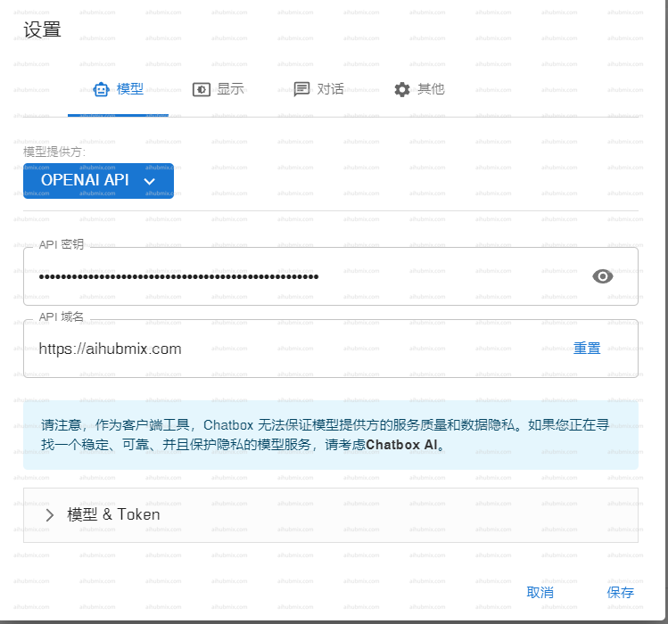

모든 데스크톱 플랫폼과 호환되는 ChatGPT 오픈 소스 데스크톱 애플리케이션입니다.  
다운로드 링크: https://github.com/Bin-Huang/chatbox/releases  
지침: 이미지에 표시된 대로 설정에서 [저희 사이트의 키](https://aihubmix.com/token)를 입력하고 프록시(API 도메인)를 다음과 같이 구성합니다.  
```
https://aihubmix.com
```
 
