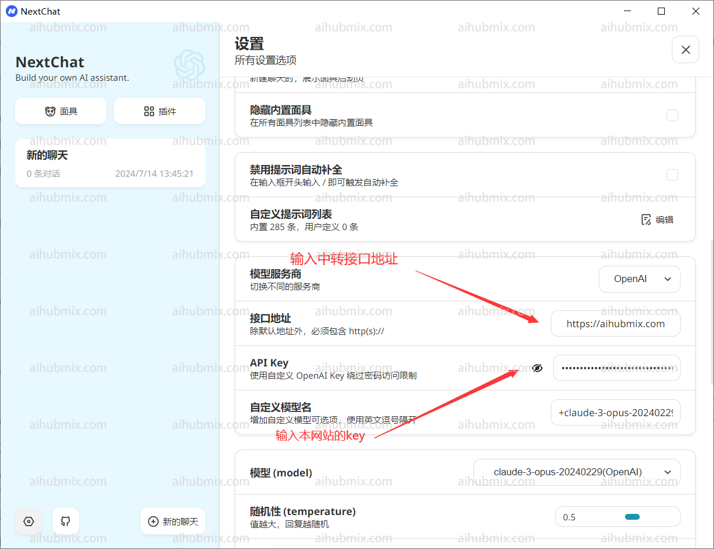
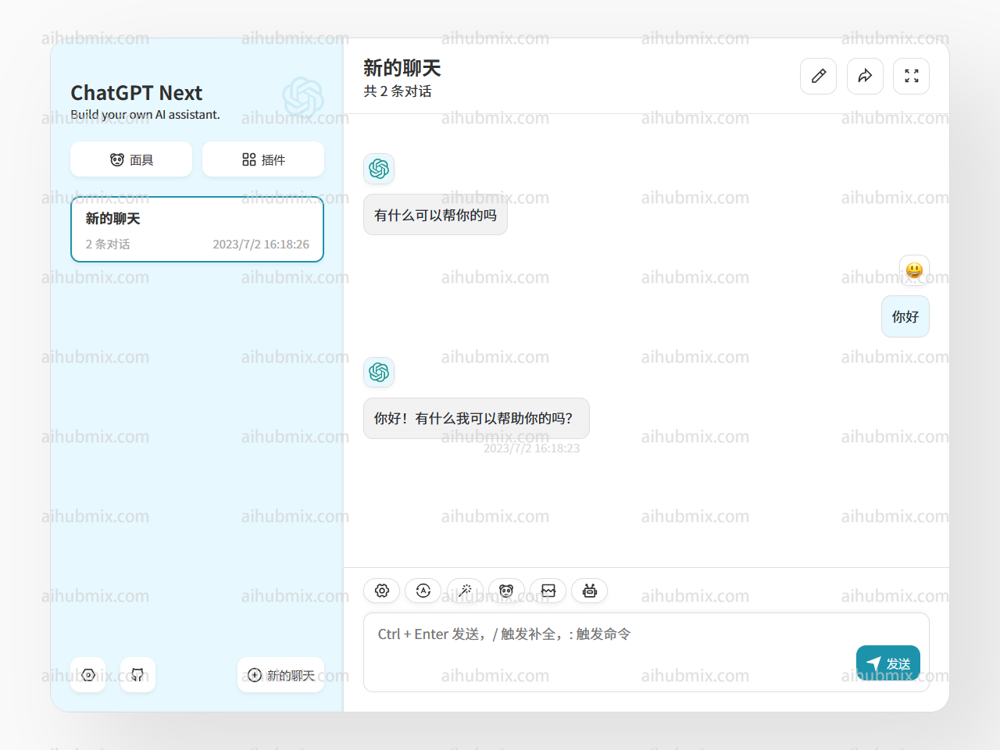
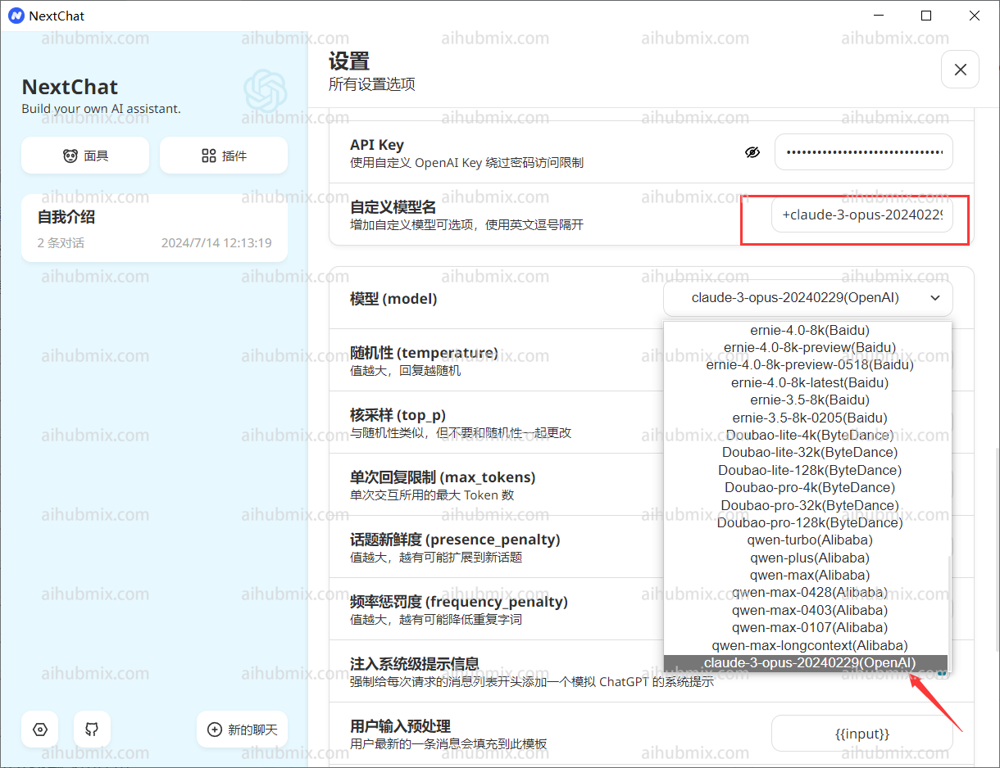

ChatGPT Next Web 데모 사이트를 예시로 사용합니다.   
## 일반적인 사용법 (OpenAI 모델 사용)
  
- API 키 입력: [사이트 키](https://aihubmix.com/token)  
- 프록시 주소: 다음 URL을 직접 입력합니다:
``` 
https://aihubmix.com
```


이제 사용을 시작할 수 있습니다.  
## 특별한 경우 (비 OpenAI 모델 사용)  
Next Web 클라이언트에서 비 OpenAI 모델을 사용하려면 다음 단계를 따르십시오.  
먼저, 최신 버전(v2.13.0)으로 업그레이드했는지 확인하십시오. 이 버전에서는 사용자 정의 모델을 위한 방법이 추가되었습니다:  
1. **사용자 정의 모델 이름 입력**:
   - Next Web 클라이언트는 입력된 모델 이름을 기반으로 모델 제공업체를 자동으로 결정하며, 이 사이트에서 제공하는 키는 OpenAI 인터페이스에만 적용됩니다.
   - 따라서 사용자 정의 모델 이름을 입력할 때 형식은 다음과 같아야 합니다: “+‘원하는 모델 이름’@OpenAI”.
   - 예를 들어, gemini-pro 모델을 사용하려면 사용자 정의 모델 이름을 “+gemini-pro@OpenAI”로 입력합니다.
   - 이렇게 하면 모델 제공업체를 수동으로 OpenAI로 지정할 수 있습니다.  
2. **선택 확인**:
   - 모델 선택 인터페이스에서 수동으로 추가된 모델(OpenAI)이 아래에 나타나는지 확인합니다. 
