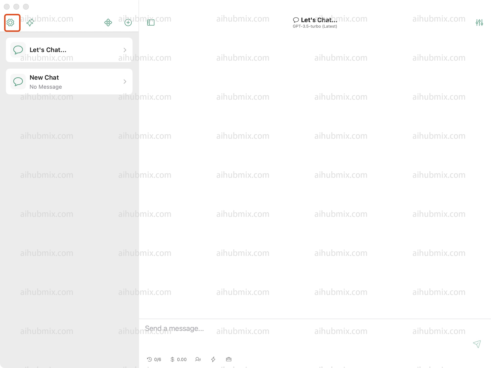
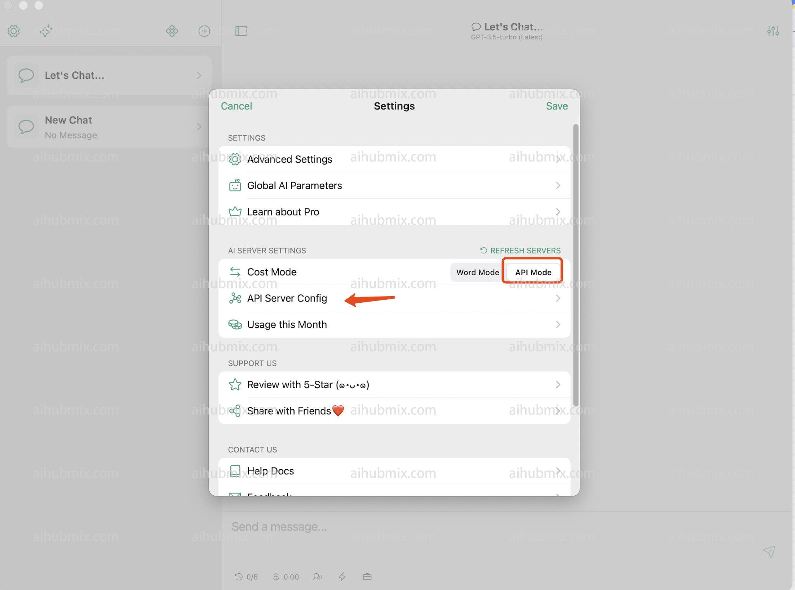
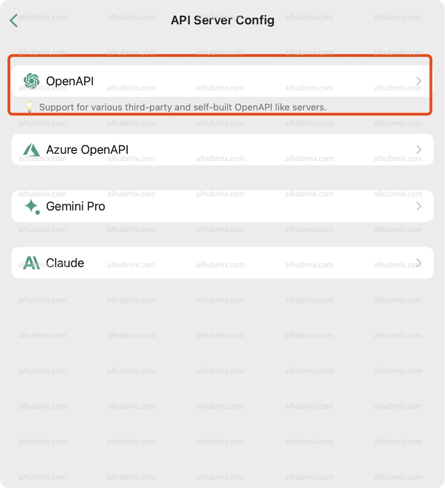
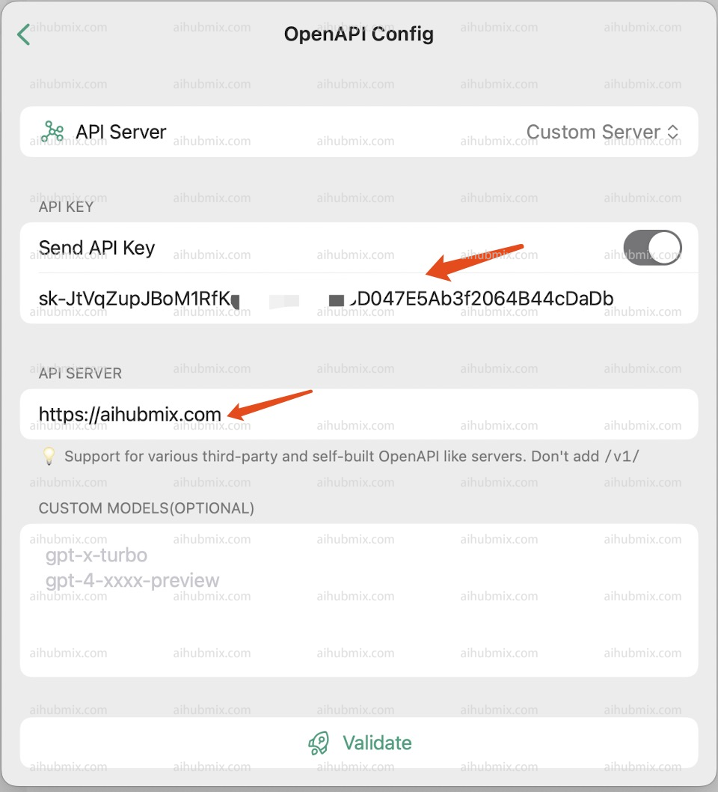

Chatx 다운로드 링크: https://apps.apple.com/app/id6446304087

1. 설정을 열고 API 서버 구성을 찾습니다.  


2. OpenAPI를 선택합니다.  

3. [저희 사이트의 키](https://aihubmix.com/token)에서 API KEY를 생성합니다.  
4. API 서버 필드에 다음을 입력합니다:
```
https://aihubmix.com
```
