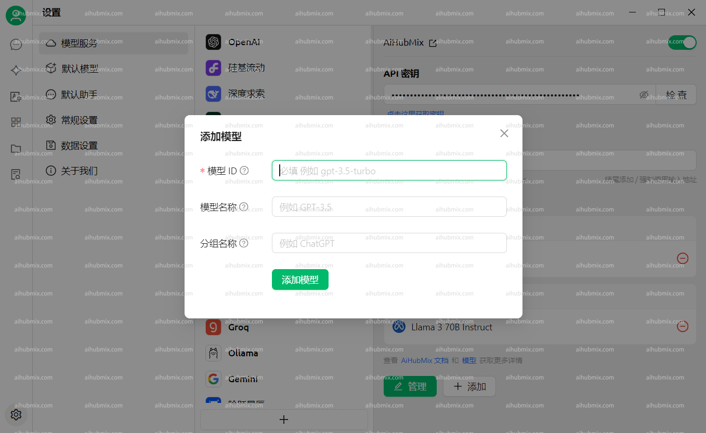

**[여기에서 Cherry Studio AI를 다운로드하세요.](https://easys.run/cherry-studio/)**

## 일반적인 사용 방법
1. 애플리케이션 왼쪽 하단에 있는 설정을 엽니다.  
  
2. 모델 제공업체 인터페이스에서 저희 AiHubMix를 선택하고 오른쪽 상단 버튼을 클릭하여 활성화합니다.  
3. API 키 필드에 [저희 사이트의 키](https://aihubmix.com/token)에서 API 키를 입력합니다. API 주소 필드는 수정할 필요가 없습니다.  
**참고: 확인에 실패하면 VPN을 끄고 다시 시도하십시오.**  
 
4. 아래의 모델 추가를 클릭하고, 저희 웹사이트의 설정 인터페이스에서 모델 ID를 복사하여 원하는 모델 이름을 붙여넣습니다.  
 

## 모델이 이미지를 볼 수 없는 문제가 발생하는 경우 
일부 새 모델에서는 모델이 입력 이미지를 볼 수 없는 문제가 발생할 수 있습니다.   
설정 페이지에서 이미지 옵션을 수동으로 확인해야 합니다.  
