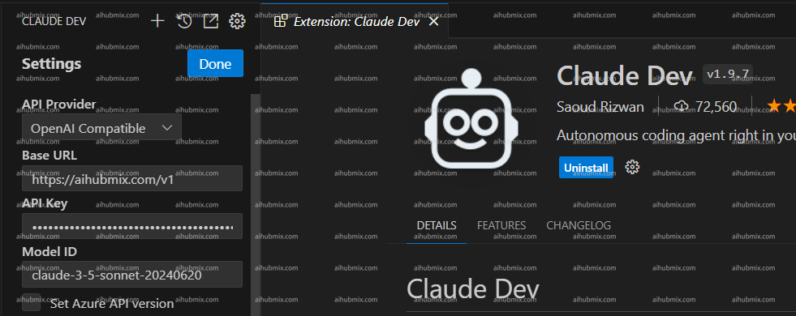

> Cline은 이전의 Claude Dev입니다.

- 플러그인을 다운로드하고 설정 페이지로 이동합니다.  
- API 제공업체 필드에서 OpenAI Compatible을 선택합니다.  
- 기본 URL 필드에 다음을 입력합니다:
```
https://aihubmix.com/v1
```
- [저희 사이트의 키](https://aihubmix.com/token)에서 API 키를 생성합니다.  
- 모델 이름을 입력하고 설정을 저장하여 사용을 시작합니다.
- **참고: 저희 사이트의 설정 페이지에서 모델 이름을 복사하여 붙여넣는 것이 좋습니다. 이미지 예시에는 claude-3-5 모델이 표시되어 있지만, gpt-4o도 사용할 수 있습니다.**
 
