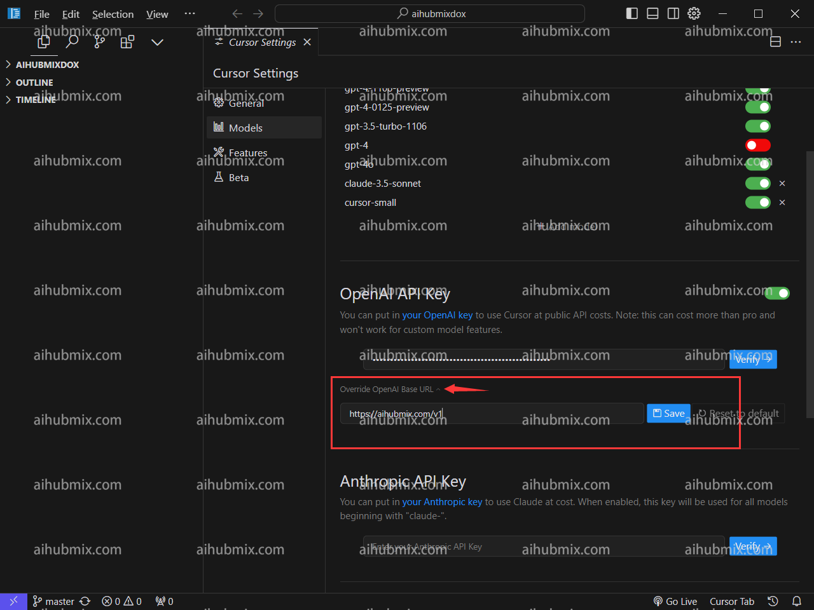

## 표준 사용 방법
- 오른쪽 상단의 톱니바퀴 아이콘을 클릭하여 설정 페이지로 이동한 후, 모델을 선택합니다.  
- Open API 키 아래에 [저희 사이트의 키](https://aihubmix.com/token)를 입력합니다.  

- OpenAI 기본 URL 재정의를 클릭하고 다음을 입력합니다:  
```
https://aihubmix.com/v1
```  

- 마지막으로, 확인을 클릭하여 올바르게 설정되었는지 확인합니다.

## 특별 지침 (Cursor에서 claude-3.5 사용)
Cursor는 요청 이름에 따라 Claude의 API를 자동으로 요청하므로, claude-3-5-sonnet-20240620에 매핑되는 새로운 이름 **anthropic-3-5-sonnet-20240620**을 추가했습니다. 이는 Cursor의 자동 요청을 우회하여 저희 서비스를 통해 Claude API를 사용할 수 있도록 합니다.  
- 구체적인 방법은 다음과 같습니다: 모델 목록에 **anthropic-3-5-sonnet-20240620**이라는 모델을 추가합니다. 이 모델을 선택하고 활성화합니다.  
