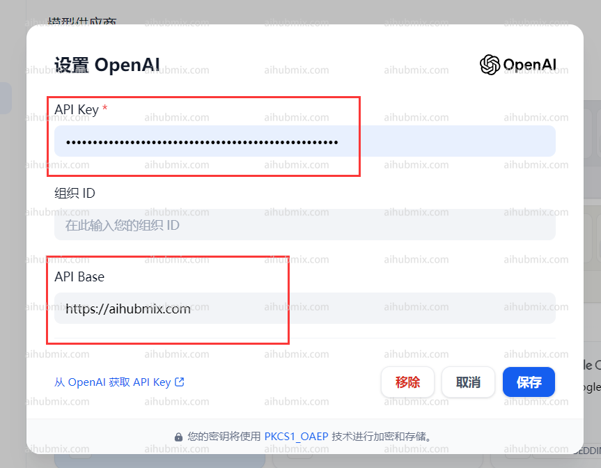
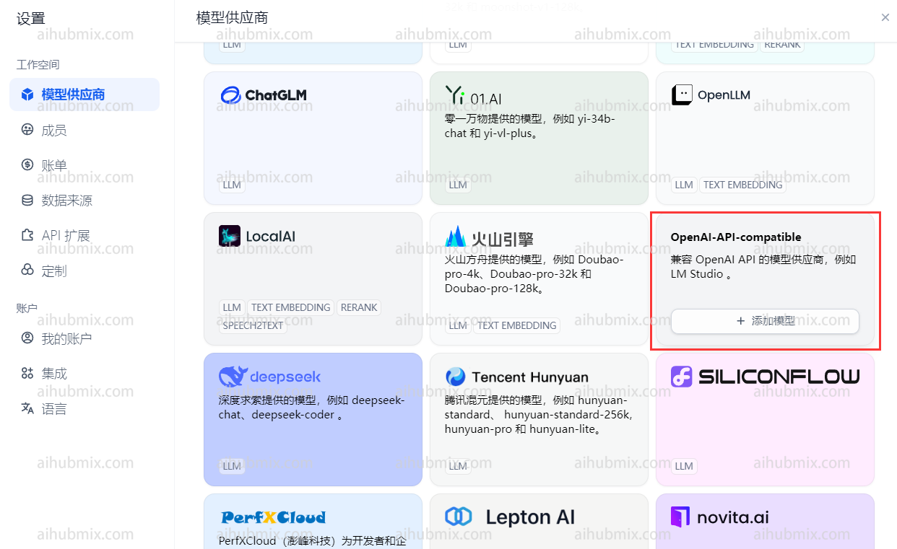
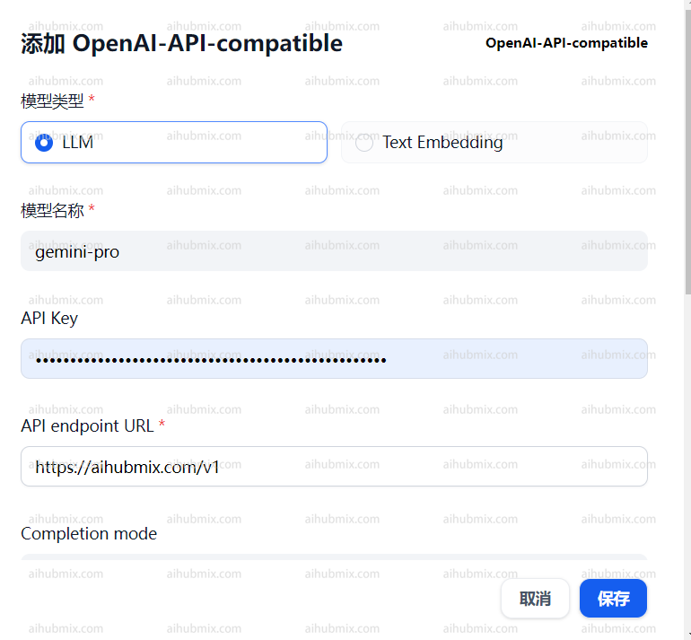

## 표준 사용법 (OpenAI 모델 사용)
웹페이지 오른쪽 상단의 사용자 이름을 클릭하여 설정 인터페이스로 들어갑니다.  
모델 제공업체 섹션에서 OpenAI를 선택하고 설정을 엽니다.  
 
- API 키 필드에 [저희 사이트의 키](https://aihubmix.com/token)를 입력합니다.  
- API 기본 필드에 다음을 입력합니다:
```
https://aihubmix.com
```  
 

## 비 OpenAI 모델 사용
모델 제공업체 드롭다운에서 OpenAI-API-호환을 찾아 모델 추가를 클릭합니다.  

- 웹사이트의 백엔드 설정 페이지를 열고 모델 목록을 찾습니다.
- 사용하려는 모델의 이름(예: gemini-pro 또는 claude-3-opus-20240229)을 복사합니다.
- API 키 필드에 [저희 사이트의 키](https://aihubmix.com/token)를 입력합니다.  
- API 엔드포인트 URL 필드에 다음을 입력합니다:
```
https://aihubmix.com/v1
```  
