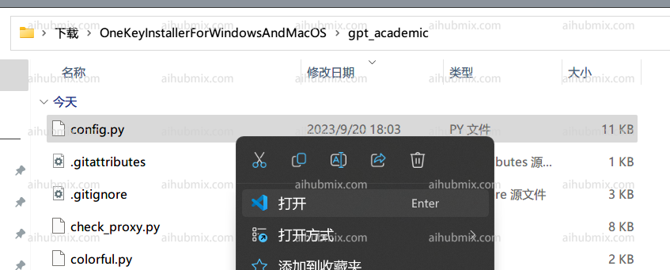
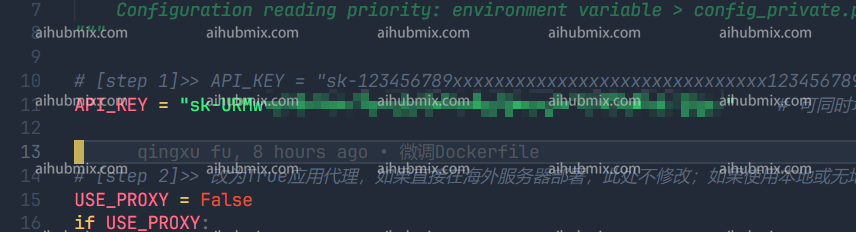
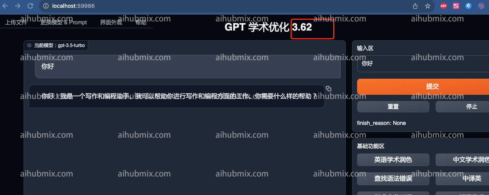

1. gpt_academic/config.py 파일을 엽니다:  
 
2. config.py에서 API_KEY 변수를 찾아 [이 사이트의 키](https://aihubmix.com/token)를 입력합니다:  
 
3. config.py에서 API_URL_REDIRECT 변수를 찾아 아래 코드 블록을 직접 복사하여 수정합니다:  
```
API_URL_REDIRECT = {"https://api.openai.com/v1/chat/completions": "https://aihubmix.com/v1/chat/completions"}
```
 
4. 이제 사용할 수 있습니다.  
 
