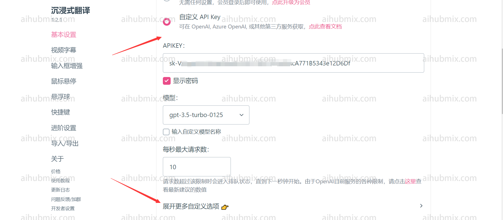

설정 인터페이스에 들어간 후, 사용자 정의 API 키를 선택하고 API 키 필드에 [저희 사이트의 키](https://aihubmix.com/token)를 입력합니다.  
 
"더 많은 사용자 정의 설정 확장"을 클릭합니다.  
 
사용자 정의 API 엔드포인트 URL을 입력합니다:
```
https://aihubmix.com/v1/chat/completions
```  