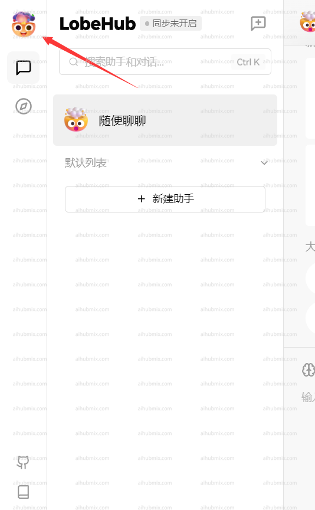
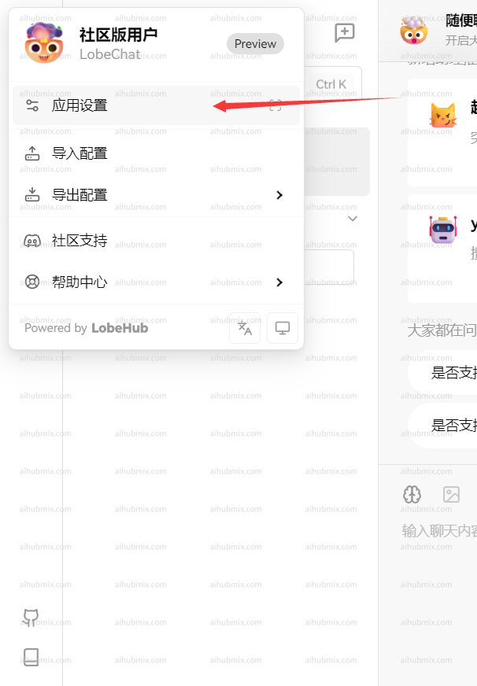
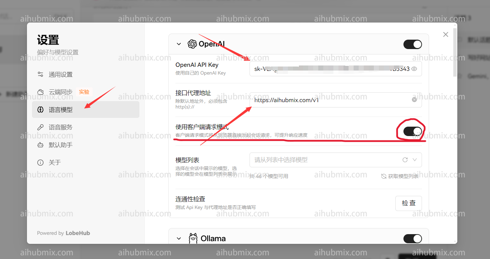
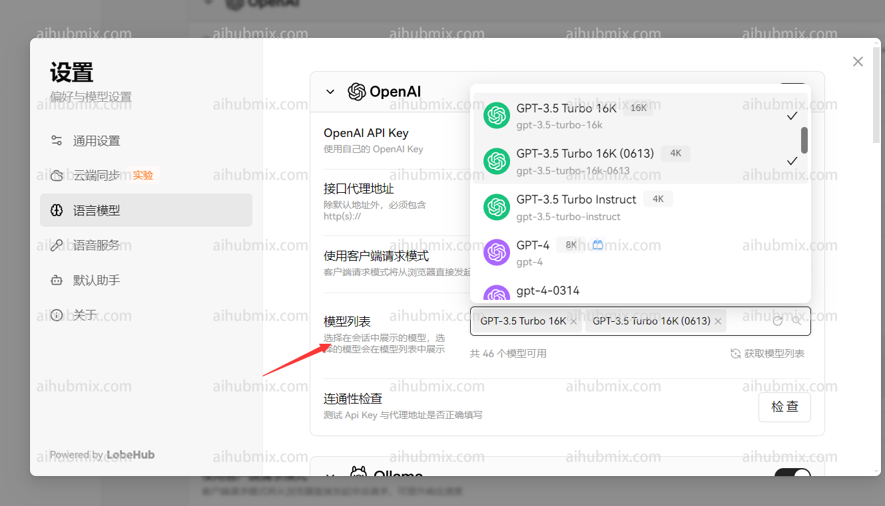

## 일반적인 사용 방법
Lobe-Chat 공식 웹사이트: [chat-preview.lobehub.com](https://chat-preview.lobehub.com/?utm_source=aihubmix&utm_medium=website&utm_campaign=references)  

아래와 같이 설정을 입력하려면 클릭하세요.  

  
- API 키: [이 사이트의 키](https://aihubmix.com/token)를 입력합니다.  
- 프록시 주소: 다음 URL을 직접 입력합니다:
``` 
https://aihubmix.com/v1
```
("클라이언트 요청 모드 사용"을 활성화하는 것이 좋습니다)  
  
마지막으로, 모델 목록에 사용하려는 모델을 추가합니다.  


## 비 openai 모델 사용 방법

모델 서비스 제공업체는 openai로 유지되며, 모델 목록에 필요한 모델 이름을 수동으로 추가할 수 있습니다.  
웹사이트의 모델 스퀘어 페이지를 열어 사용하려는 모델 이름을 복사할 수 있습니다.