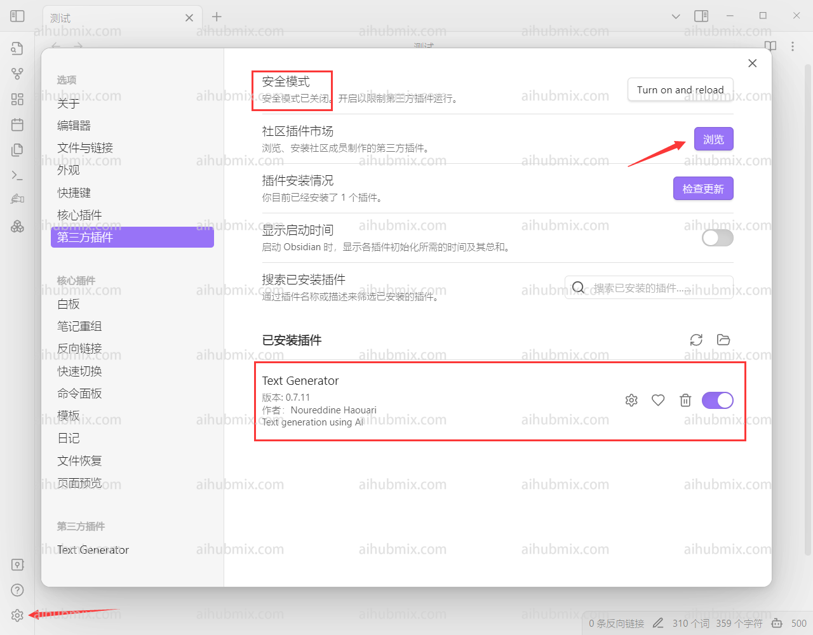
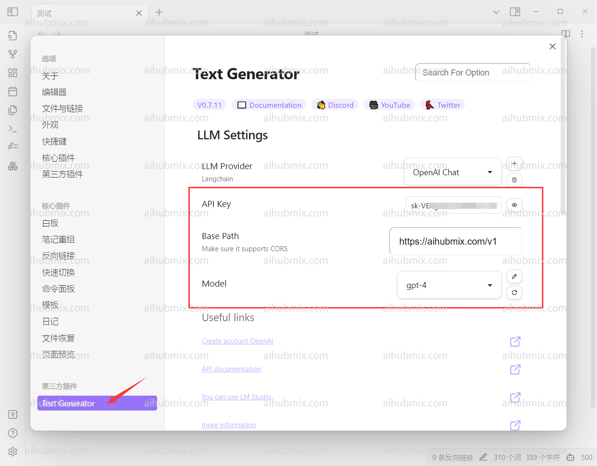

> 텍스트 생성기 플러그인이 필요합니다.

1. 소프트웨어 왼쪽 하단의 설정으로 이동하여 커뮤니티 플러그인을 선택합니다.  
   안전 모드를 끈 후, 커뮤니티 플러그인 마켓에서 "text generator"를 검색하여 설치하고 활성화합니다.  
  
2. 텍스트 생성기 설정 페이지로 들어갑니다.  
3. [저희 사이트의 키](https://aihubmix.com/token)에서 API KEY를 생성합니다.  
4. 기본 경로 필드에 다음을 입력합니다:
```
https://aihubmix.com/v1
```
5. 마지막으로, 사용하려는 모델을 선택합니다.  
  
6. 텍스트를 입력할 때, 왼쪽에 있는 손 모양 버튼을 클릭합니다.  
  