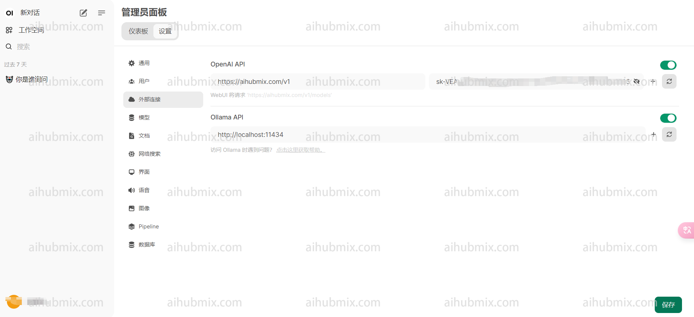

---
title: "Open WebUI 사용법"
description: ""
icon: ''
--- 

등록 및 로그인 후, 아바타를 클릭하여 관리자 패널로 들어갑니다.  
외부 링크를 선택하고 Open API 아래의 두 필드를 구성합니다.  
- 오른쪽 필드에 [저희 사이트의 키](https://aihubmix.com/token)를 입력합니다.  
- 왼쪽 필드에 다음을 입력합니다:
```
https://aihubmix.com/v1
```  
