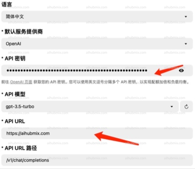

- 예시: OpenAI Translator;  
- API 키를 [저희 사이트의 키](https://aihubmix.com/token)에서 생성된 키로 변경합니다.  
- API URL을 다음으로 변경합니다:
```
https://aihubmix.com
```
(참고: URL 끝에 "/"를 포함하지 마십시오)  
 

## 모델 로드에 문제가 발생하는 경우
**참고:**
버전 0.4.33 및 0.4.34에서 모델을 로드할 수 없는 경우, 이전 버전으로 되돌리십시오.  
이전 버전 링크: https://github.com/openai-translator/openai-translator/releases/tag/v0.4.32  
OpenAI Translator에서 API 모델 선택이 허용되지 않는 문제가 발생하는 경우:
  
**다음 해결 방법을 시도할 수 있습니다:**
- "모델 없는 API 지원" 옵션을 확인합니다.
- 저희 웹사이트의 설정 페이지에서 모델 이름을 복사하여 수동으로 입력합니다.

