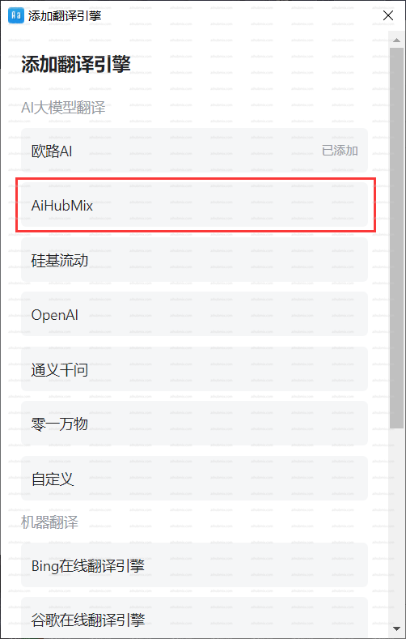
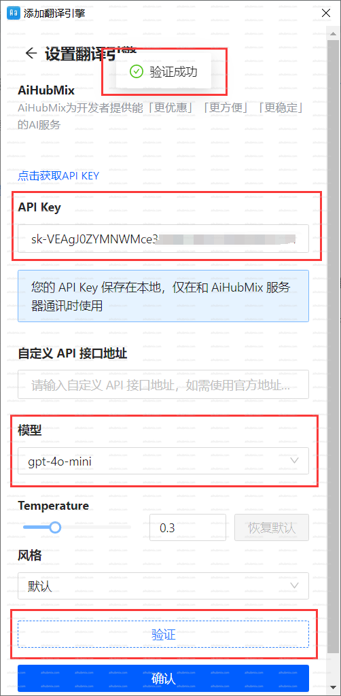

- 왼쪽 하단의 톱니바퀴 아이콘을 클릭하여 설정 페이지로 들어간 다음, "번역 엔진"과 "더 많은 번역 엔진 다운로드"를 선택합니다.  
  
- 번역 엔진을 추가하고 저희 AiHubMix를 선택합니다.  
  
- "API 키" 필드에 [저희 사이트의 키](https://aihubmix.com/token)를 입력합니다.  
- 모델을 선택하고 인증을 클릭합니다. 확인되면 확인을 클릭합니다.  

