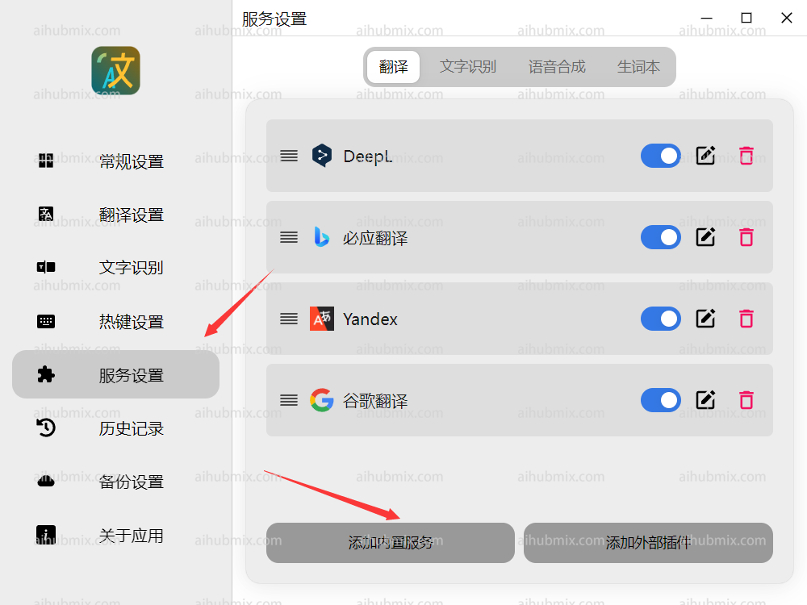
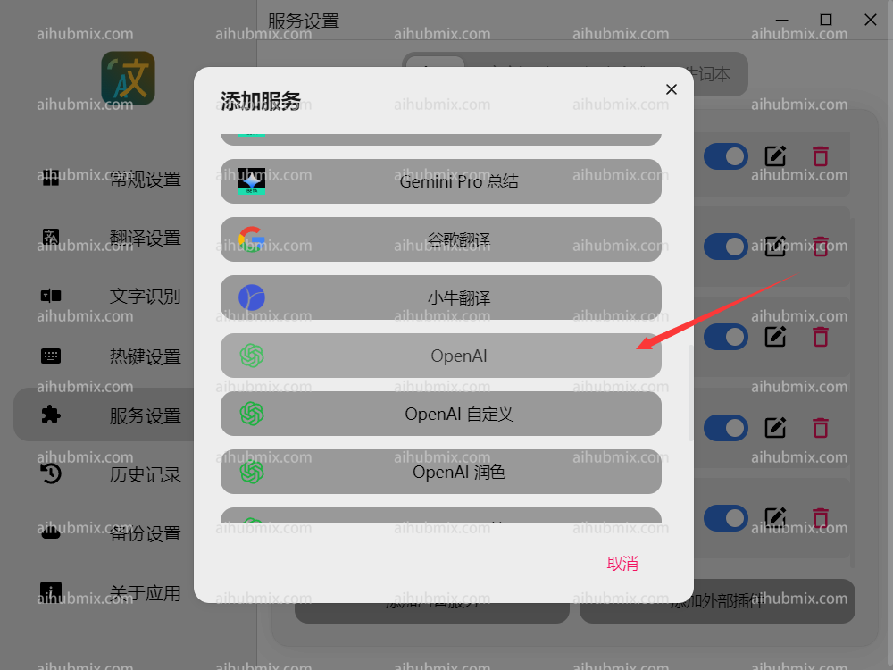
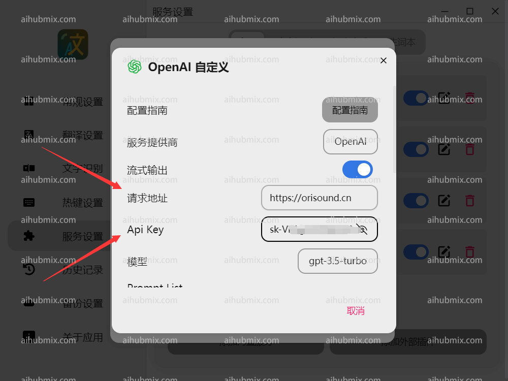
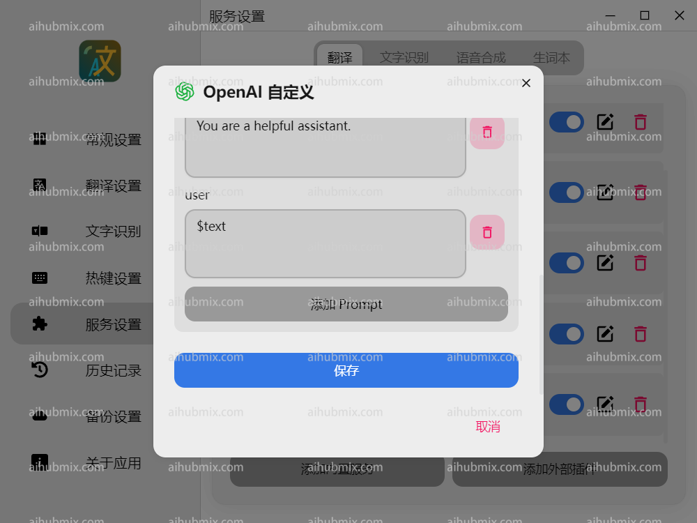

다운로드 링크: https://pot-app.com/
1. Pot 번역기를 열고 서비스 설정에서 내장 서비스 추가를 선택합니다.  
  
2. OpenAI를 클릭합니다.  
 
3. 요청 URL을 다음으로 설정합니다: 
```
https://aihubmix.com
```    
4. [저희 사이트의 키](https://aihubmix.com/token)에서 API 키를 생성합니다.   

5. 아래로 스크롤하여 저장합니다.  
