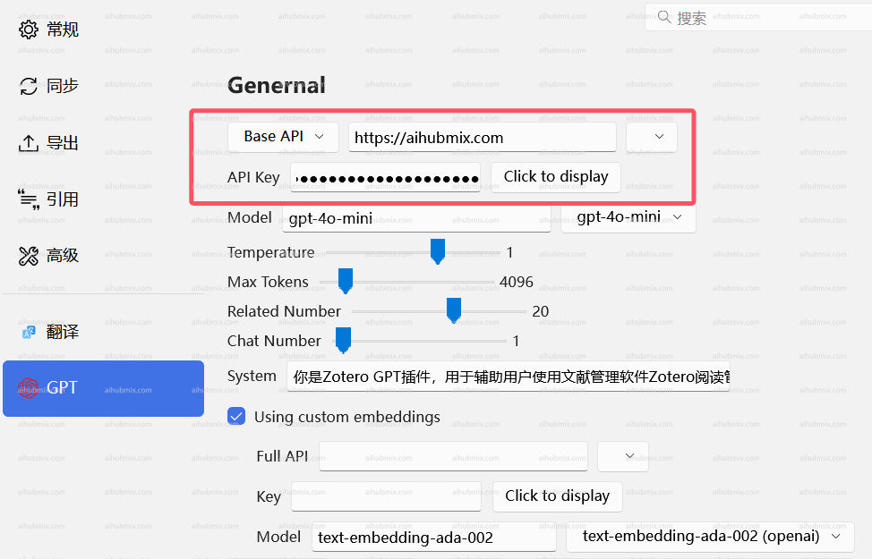

## PDF 읽기 플러그인: zotero-gpt
다운로드 링크: https://github.com/MuiseDestiny/zotero-gpt/releases

플러그인 설치 후, 편집 메뉴에서 설정(이전 버전에서는 환경설정)을 찾습니다. GPT 설정 인터페이스를 찾습니다.  
 
그림과 같이 기본 API를 구성하고 [API 키](https://aihubmix.com/token)를 입력합니다.

다음 명령어를 사용하여 설정하는 경우. 

먼저, "Ctrl + /"를 사용하여 명령 창을 엽니다.  
  
```
/api https://aihubmix.com
```
을 입력하고 Enter를 누릅니다.  
 
  
```
/secretKey + 귀하의 API 키 (키에서 생성된, sk- 포함)
```
를 입력합니다.  
 
  
모델 전환 명령어  
```
/model gpt-3.5-turbo-0125 
```
  
사용하려는 모델을 선택한 후, 사용을 시작할 수 있습니다.  
  

## 번역 플러그인: zotero-pdf-translate
다운로드 링크: https://github.com/windingwind/zotero-pdf-translate/releases

편집 메뉴에서 설정(이전 버전에서는 환경설정)을 찾습니다. 번역 설정 인터페이스를 찾습니다.  
API 엔드포인트 URL을 다음과 같이 입력합니다: 
```
https://aihubmix.com/v1/chat/completions
```  
상태가 사용 가능으로 표시되는지 여부는 걱정하지 마십시오. 그냥 채워 넣으면 작동합니다.  
 