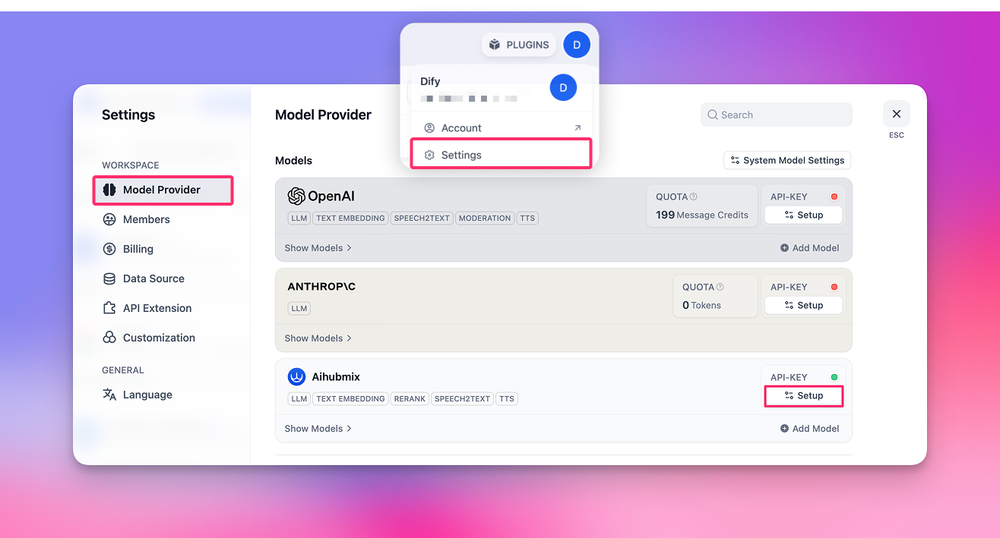
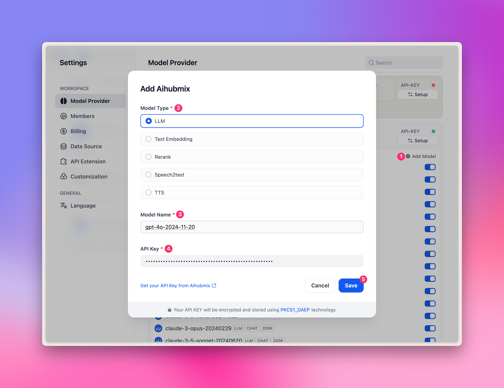
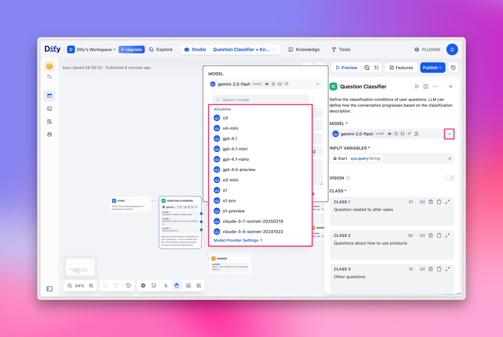

## 一鍵安裝 Aihubmix 外掛

直接點擊下方連結，在 Dify Marketplace 頁面點擊「Install」按鈕即可完成安裝：

👉 [前往 Dify 外掛市場](https://marketplace.dify.ai/plugins/langgenius/aihubmix?language=en-US&theme=system)

**示例圖如下：**
  

## 配置
1. 首先點擊頁面右上角頭像 → 選擇「Settings」選單
2. 點擊左側「Model Provider」Tab
3. 在右側找到 Aihubmix → 展開 Setup，填入你的[API Key](https://aihubmix.com/token)

  

**目前預設的模型有以下 5 大類：**
- LLM：大語言模型
- TEXT EMBEDDING：向量嵌入模型
- RERANK：重排序模型
- SPEECH2TEXT：語音轉文字模型
- TTS：文字轉語音模型

  

**如何新增更多自定義模型？**

點擊「+ Add model」，在彈出面板的 Model Name 選項裡：
- 填入模型廣場中的任何[模型 ID](https://aihubmix.com/models)，比如 `gpt-4o-2024-11-20`。
- 填入你的 API Key 後，點擊「Save」即可。

需要注意的是，由於 Dify 外掛的設計特殊性，目前暫不支援繪圖模型，因此像是 `gpt-image-1` 這種繪圖模型無法加入。

  

## LLM 選擇

在工作流 (Workflow) 節點中，選擇「LLM」，即可選擇外掛中已經配置好的，由 Aihubmix 提供的模型。

**示例圖如下：**
  

## Embeddings/Reranker 模型選擇

Embeddings/Reranker 模型主要用於知識庫問答，你可以在頂部的 Knowledge Tab 快速體驗，也可以在工作流節點中選擇相應的模型。

**示例圖如下：**
  

## TTS/SST 選擇

TTS/SST 模型主要用於語音解析與合成，選擇工具時，對應的不是常規的「LLM」，而是「Tools」Tab 裡面的「Audio」 類型。
對應關係：
1. TTS 文轉音：選擇「Text to Speech」
2. SST 音轉文：選擇「Speech to Text」

**示例圖如下：**
