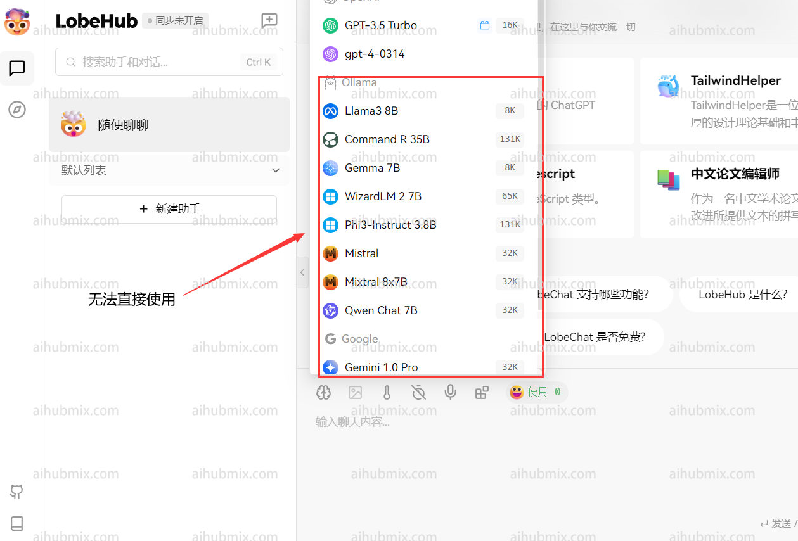
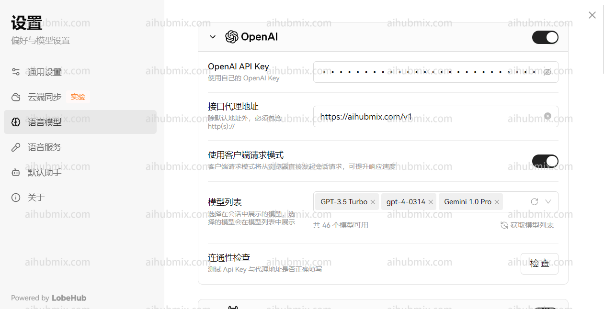
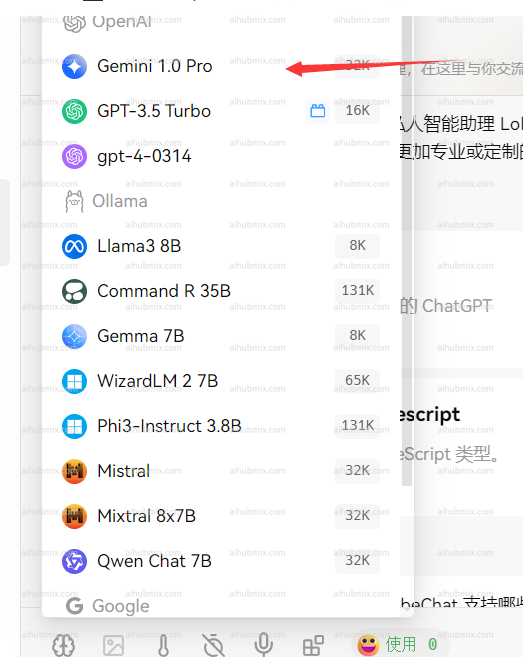

## 原理

本站以 OpenAI 模型調用接口為標準，聚合了多個非 OpenAI 模型，包括但不限於谷歌的 Gemini-2.0-flash、Claude Sonnet 3.7 等模型。調用非 OpenAI 模型和調用 OpenAI 模型一樣，只需要修改對應的 `模型 ID` 即可。模型 ID 見網站後台設定頁面：
  

## 應用場景（Lobe-chat 為例）

通常情況下本網站提供的 key 僅可調用 OpenAI 模型（如 gpt-4 等等）。
  

如果想要調用聚合的模型，可以透過自定義模型名稱的方式實現。  
1. 首先打開設定界面，找到模型列表一欄。  
2. - 打開網站模型廣場頁面。
   - 複製你想要使用的模型名稱（如 o3-mini 或 gemini-2.0-flash）。  
  


3. - 輸入你想要使用的模型名稱並選擇。
   - 確認手動新增的模型出現在 open ai 一欄的下方。  
   
4. 選擇 open ai 一欄中自己要使用的模型（比如 gpt-4o-mini），效果如下：
   

## 開發調用 - 以官方庫為例子
   - 使用官方庫示例代碼進行調用。以下是一個 Python 示例代碼：  

```python
from openai import OpenAI

client = OpenAI(
    api_key="sk-***", # 換成你在 AiHubMix 生成的密鑰
    base_url="https://aihubmix.com/v1"
)

chat_completion = client.chat.completions.create(
    messages=[
        {
            "role": "user",
            "content": "Say this is a test",
        }
    ],
    model="gpt-4o-mini",
)

print(chat_completion)
```
## 特殊情況（Next Web 客戶端）  
如果你使用的是 Next Web 客戶端，確保你已經升級到最新版本（v2.13.0）。在這個版本中，增加了自定義模型的方式：  
1. **輸入自定義模型名：**
   - 由於 Next Web 客戶端會根據輸入的模型名稱自動判斷模型服務商，而本網站提供的 key 只適用於 OpenAI 接口。   
   - 所以在輸入自定義模型名時，格式應為："+'想使用的模型名字'@OpenAI"。
   - 例如，若要使用 gemini-pro 模型，自定義模型名輸入："+gemini-pro@OpenAI"。
   - 透過這種方式，可以把模型服務商手動指向 OpenAI。  
2. **確認選擇：**
   - 在選擇模型界面，確認手動新增的模型（OpenAI）出現在下方。  


