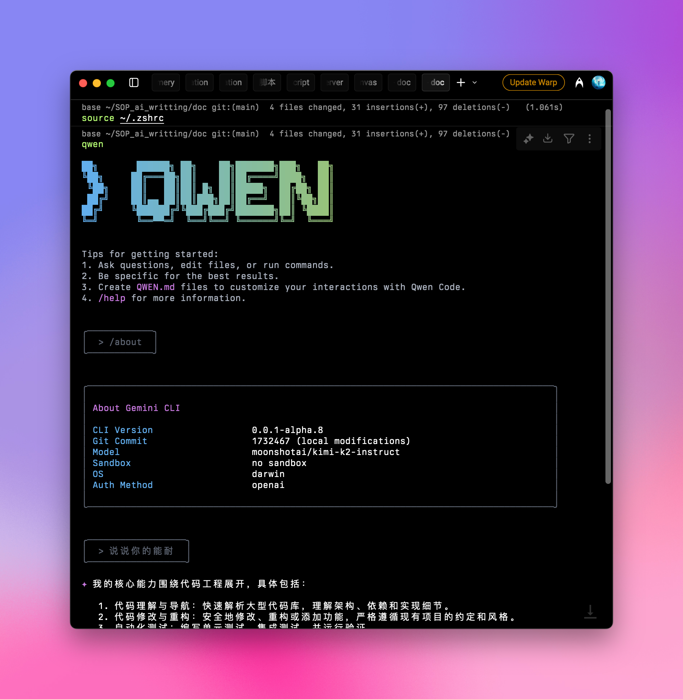

## 快速設定指南：

### 1️⃣ 全域安裝 npm 套件

請確保您的 Node.js 版本 ≥ 20，然後在您的終端機中執行以下指令：

```shell
npm install -g @qwen-code/qwen-code
qwen --version
```

更多詳情，請參閱[官方儲存庫](https://github.com/QwenLM/qwen-code)

### 2️⃣ 設定環境變數

將您的 Aihubmix 金鑰和轉發位址新增至您的系統環境變數。您可以在 Aihubmix 的 [金鑰頁面](https://aihubmix.com/token) 產生金鑰。

例如，將以下內容新增至您的 ~/.zshrc：

```shell
export OPENAI_API_KEY="your_aihubmix_key"
export OPENAI_BASE_URL="https://aihubmix.com/v1"
export OPENAI_MODEL="your_model"
```

<Tip>
  對於 Mac 使用者，您可以使用快捷鍵 `⌘ + ⇧ + .` 在您的家目錄中顯示隱藏的 `.zshrc` 檔案。使用系統的「文字編輯」應用程式開啟它，並新增以上幾行。
</Tip>

### 3️⃣ 套用設定

新增設定後，在您的終端機中執行 `source ~/.zshrc` 並按下 Enter 鍵。

### 4️⃣ 啟動與使用

在您的終端機中輸入以下指令：

```shell
qwen
```

啟動後，輸入 `/about` 並按下 Enter 鍵以確認您的設定。您將會看到目前的版本和所選的大型語言模型：



您現在可以正常使用 Qwen Code 了。
