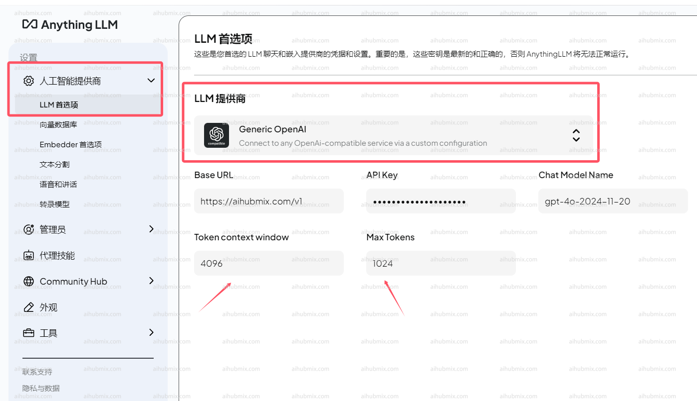

## 通常使用方法

AnythingLLM 官方網址：[AnythingLLM](https://anythingllm.com/)  

進入下圖所示的設定頁面：
  

LLM 提供商選擇 Generic OpenAI（通用 Openai）  
- Base URL 一欄輸入下方的網址：
  
``` 
https://aihubmix.com/v1
```

- APIkey 輸入[本站的 Key](https://aihubmix.com/token)  
- Chat Model Name 一欄輸入自己需要用的模型名稱。  
- **注 Token context window 和 Max Tokens 根據模型不同可以填不同的大小。**  

## 非 openai 模型使用方法

模型服務商選擇 Generic OpenAI 不變，在 Chat Model Name 一欄手動修改所需模型名稱即可。  
打開網站模型廣場頁面即可複製你想要使用的模型名稱。  