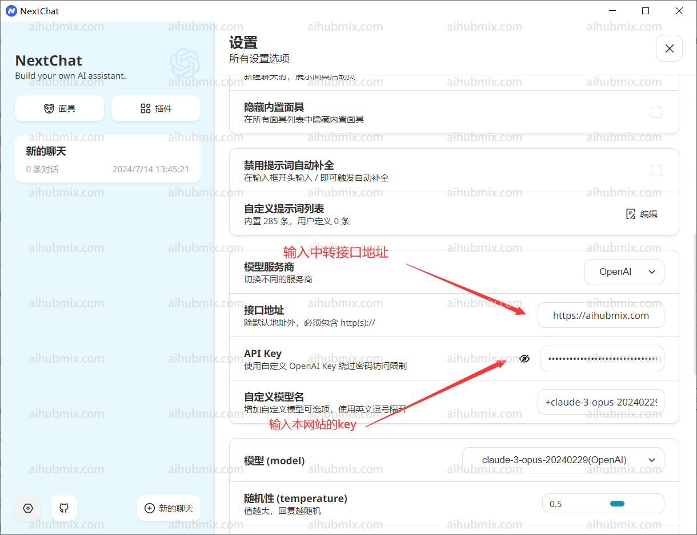

我們以 ChatGPT Next Web 的演示站點為例   
## 通常使用情況（使用 OpenAI 模型）
  
- API key 輸入[本站的 Key](https://aihubmix.com/token)  
- 接口代理地址，直接輸入下方的網址：
``` 
https://aihubmix.com
```


然後即可開始使用。  
## 特殊情況（使用其他非 OpenAI 模型）  
如果想在 Next Web 客戶端使用其他非 OpenAI 模型，那麼請按以下步驟。  
首先確保你已經升級到最新版本（v2.13.0）。在這個版本中，增加了自定義模型的方式：  
1. **輸入自定義模型名**：
   - 由於 Next Web 客戶端會根據輸入的模型名稱自動判斷模型服務商，而本網站提供的 key 只適用於 OpenAI 接口。   
   - 所以在輸入自定義模型名時，格式應為："+'想使用的模型名字'@OpenAI"。
   - 例如，若要使用 gemini-pro 模型，自定義模型名輸入："+gemini-pro@OpenAI"。
   - 透過這種方式，可以把模型服務商手動指向 OpenAI。  
2. **確認選擇**：
   - 在選擇模型界面，確認手動新增的模型（OpenAI）出現在下方。  
