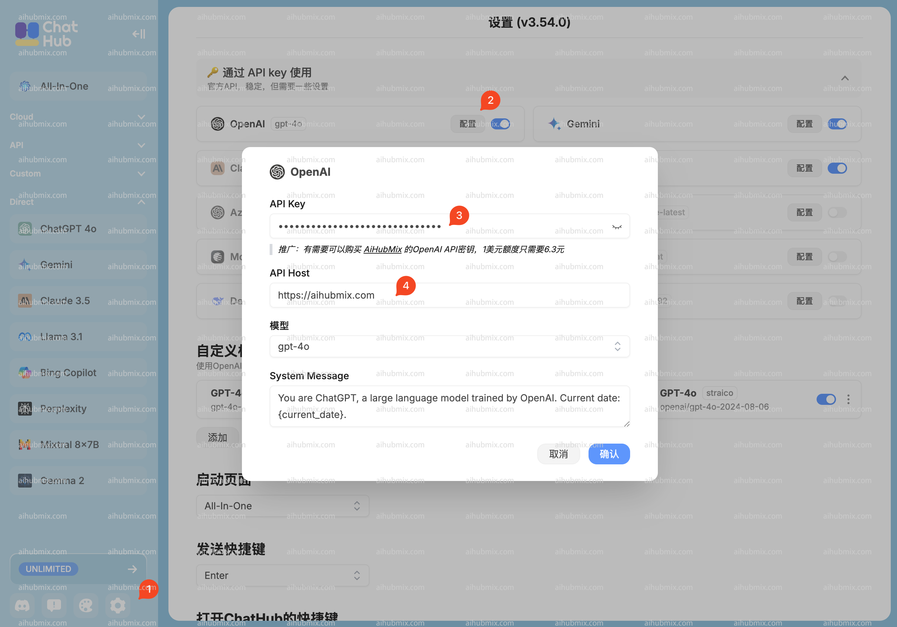

---
title: "在 ChatHub 中使用"
description: ""
icon: ''
-

1. 透過 ChatHub 官網安裝 Chrome 插件：https://chathub.gg  

2. 點擊 ChatHub 插件左下角的齒輪進行設定（圖中紅1）  

3. 點擊「透過 API key 使用」列表中 OpenAI 的「配置」按鈕（圖中紅2）  

4. 輸入你的 AiHubMix API key，在[本站的 Key](https://aihubmix.com/token) 中產生（ key 的格式為：sk-***），之後複製填入（圖中紅3）  

5. API Host 改成 AiHubMix 網站的地址：（圖中紅4）  
```
https://aihubmix.com
``` 
   


