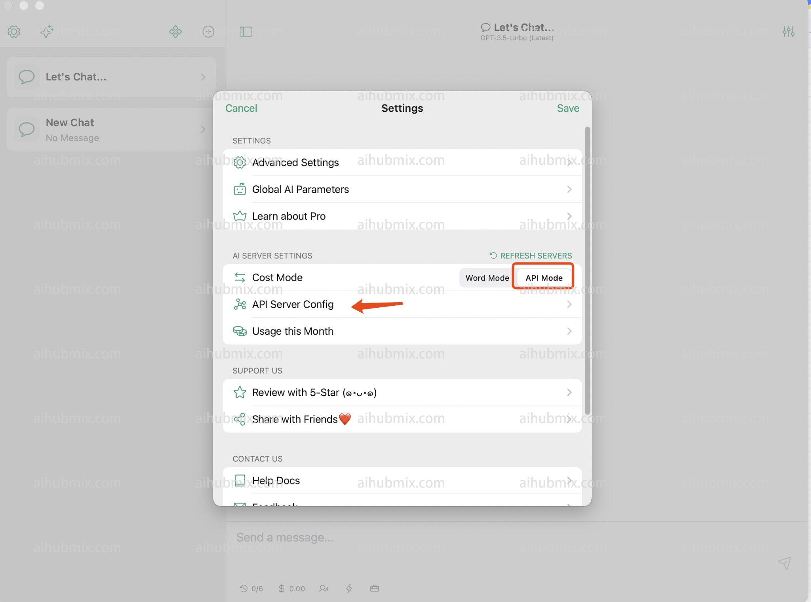
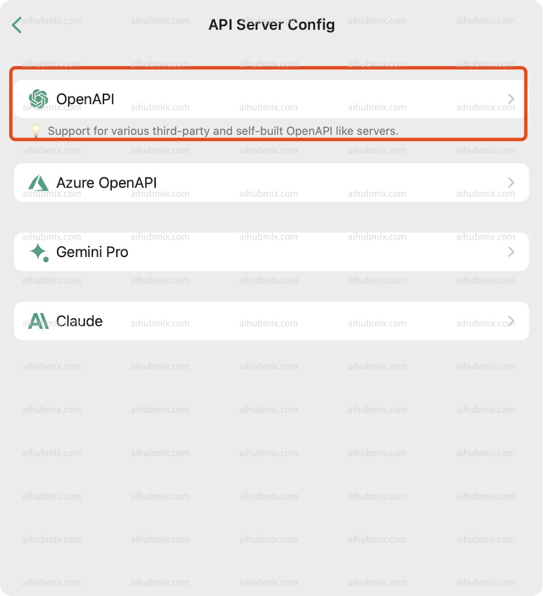

Chatx 下載地址：https://apps.apple.com/app/id6446304087
1. 打開設定，在設定中找到 API Server Config。  


2. 選擇 OpenAPI。  

3. 上方 API KEY 一欄從[本站的 Key](https://aihubmix.com/token) 中產生。  
4. 下方 API SERVER 填寫：
```
https://aihubmix.com
```
