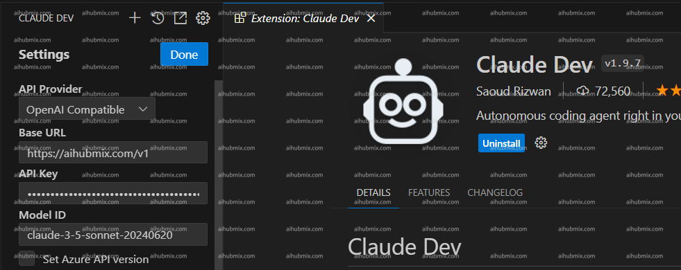

> Cline 即原來的 Claude Dev

- 下載外掛，進入設定頁面。  
- API Provider 一欄選擇 OpenAl Compatible。  
- Base URL 一欄輸入：
```
https://aihubmix.com/v1
```
- API Key 一欄從[本站的 Key](https://aihubmix.com/token)中產生。  
- 輸入模型名後儲存設定即可使用。
- **注：模型名稱建議從本站設定頁面複製貼上。圖片範例為 claude-3-5 模型，gpt-4o 也可以使用。**
 
