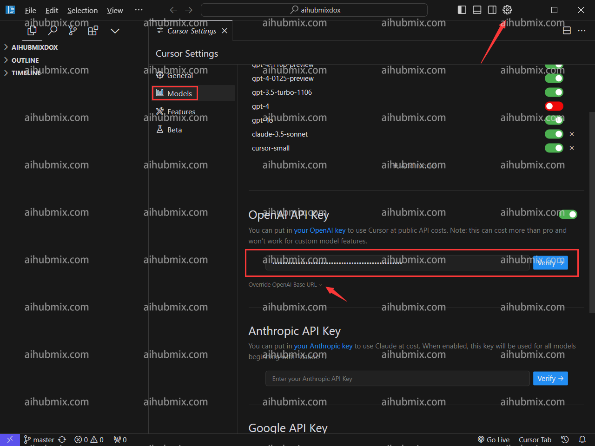
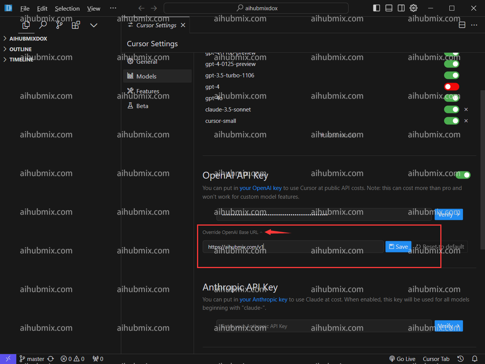
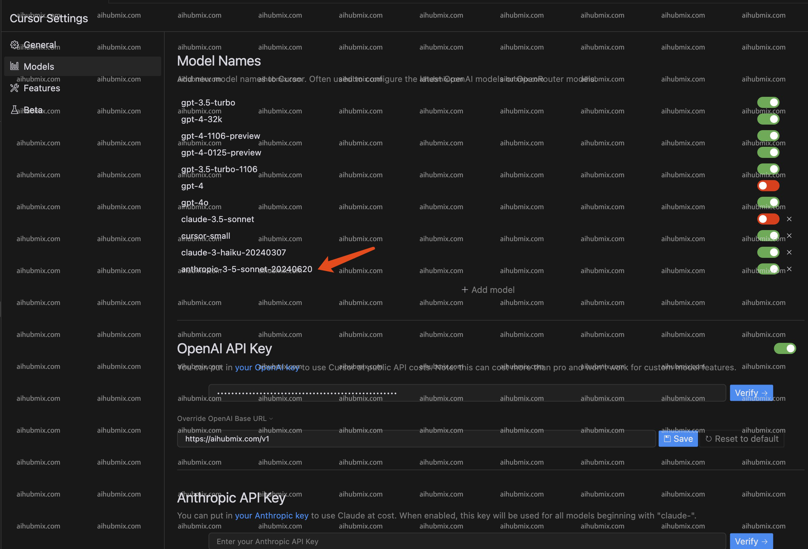

## 通常使用方法
- 右上角點擊齒輪進入設定頁面，選擇Models。  
- 在Open API key下方輸入[本站的Key](https://aihubmix.com/token)。  

- 點擊Override OpenAl Base URL，輸入：  
```
https://aihubmix.com/v1
```  

- 最後點擊Verify驗證通過即可。

## 特殊說明（在Cursor中使用claude-3.5的方法）
由於cursor自動根據請求名請求claude的api接口，所以為了可以通過我們的服務正常使用claude-3.5模型，  
我們新增了一個**anthropic-3-5-sonnet-20240620**的名字來映射到claude-3-5-sonnet-20240620，  
以此來繞過cursor的自動請求，從而通過我們走claude接口。  
- 具體使用方法為：在模型列表中新增名為：**anthropic-3-5-sonnet-20240620**的模型。選擇啟用該模型即可。  
