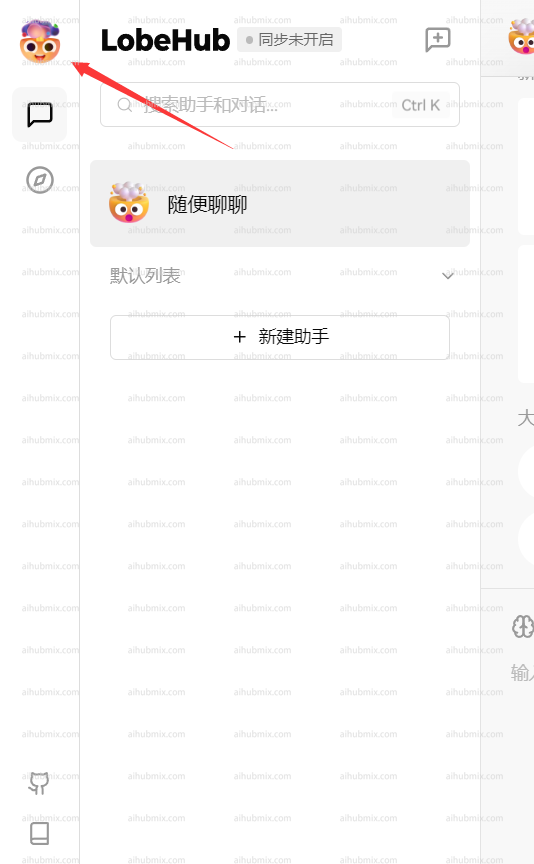
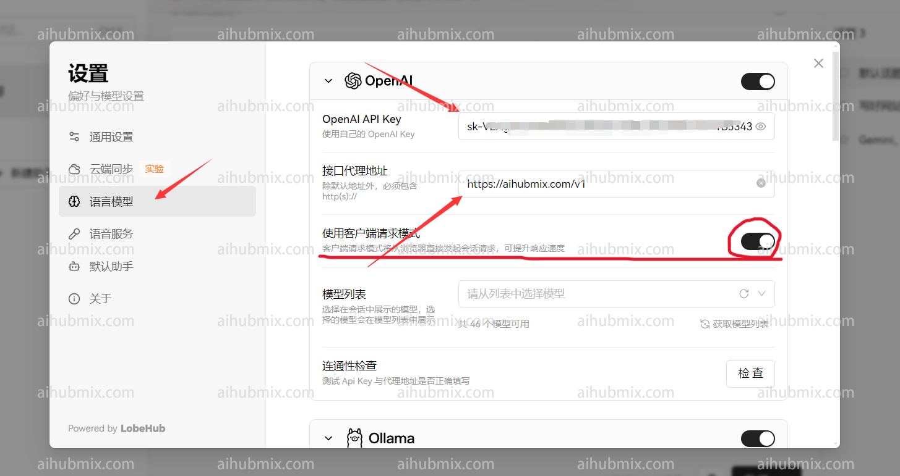
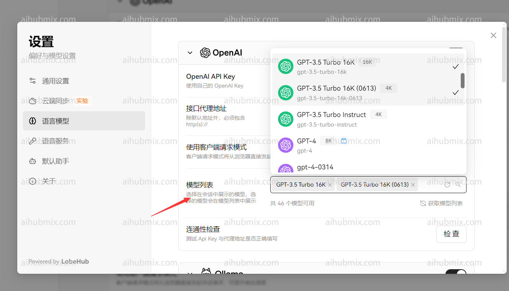

## 通常使用方法

lobe-chat官方網址：[chat-preview.lobehub.com](https://chat-preview.lobehub.com/?utm_source=aihubmix&utm_medium=website&utm_campaign=references)  

如下圖所示點擊進入設定  

  
- API key 輸入[本站的Key](https://aihubmix.com/token)  
- 接口代理地址，直接輸入下方的網址：
``` 
https://aihubmix.com/v1
```
（建議打開"使用客戶端請求模式"）  
  
最後在模型列表新增自己要使用的模型  


## 非openai模型使用方法

模型服務商選擇 openai 不變，在模型列表手動新增所需模型名稱即可。  
打開網站模型廣場頁面即可複製你想要使用的模型名稱。  