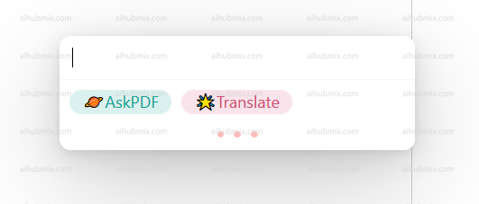
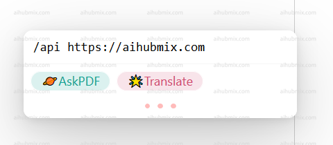
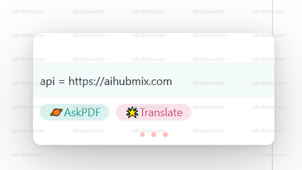
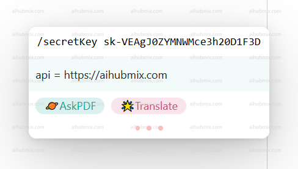
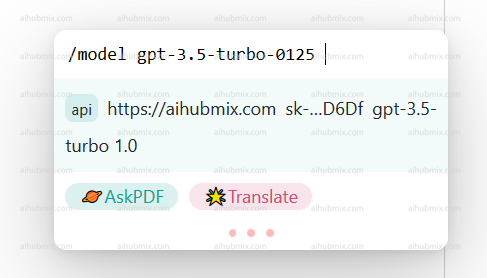
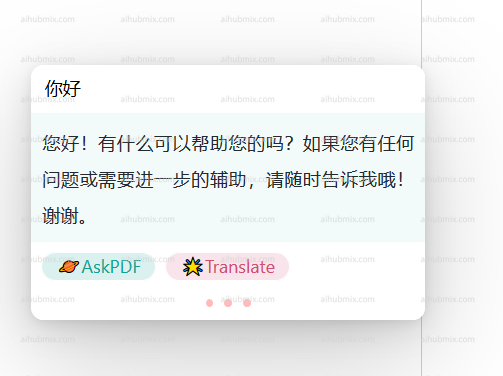
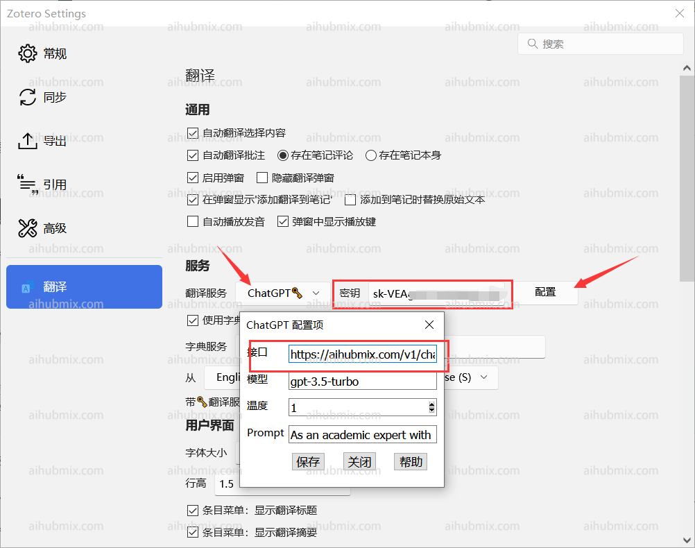

## PDF 閱讀插件 zotero-gpt
下載連結：https://github.com/MuiseDestiny/zotero-gpt/releases

安裝好插件後在編輯中找到設定（舊版本在編輯中偏好設定）。找到 GPT 的設定介面

按照如圖所示配置 Base API，並輸入[API key](https://aihubmix.com/token)

或者使用以下命令設定

首選使用「ctrl＋/」打開使用視窗  
  
輸入
```
/api https://aihubmix.com
```
並回車  
 
  
輸入
```
/secretKey ＋ 密鑰 sk-***
```
 
  
切換模型命令  
```
/model gpt-3.5-turbo-0125 
```
  
選擇自己要用的模型之後就可以使用了。  
  

## 翻譯插件 zotero-pdf-translate
下載連結：https://github.com/windingwind/zotero-pdf-translate/releases

編輯中找到設定（舊版本在編輯中偏好設定）。找到翻譯的設定介面  
接口地址填寫: 
```
https://aihubmix.com/v1/chat/completions
```  
不用管狀態是否顯示可用 填上之後就可以了。  
 
