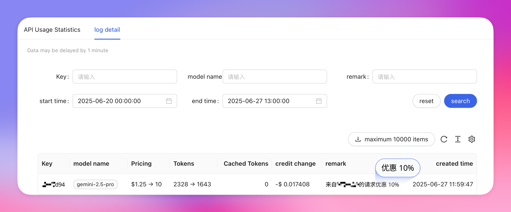

主要用於優化你的 API 呼叫成本，**根據你的有效網域產生一行標識碼，加入 headers 立即生效。**

- **對於平台**：平台方所有 Aihubmix 呼叫成本得到降低，使用者本身沒有優惠。
- **對於開發者或一般使用者**：透過你的工具發出的 Aihubmix 呼叫都享有優惠，即使由你的使用者發起。

接入並使用之後，你會在用量的日誌明細中看到請求的優惠。



## 1️⃣ 呼叫方式：

<CodeGroup>

```shell Curl 方式
curl https://aihubmix.com/v1/responses \       
  -H "Content-Type: application/json" \
  -H "Authorization: Bearer sk-***" \
  -H "APP-Code:***" \
  -d '{
    "model": "gpt-4o-2024-11-20",
    "input": "Hello! Please say Hello back to me."
  }'
```


```py Openai sdk 方式
completion = client.chat.completions.create(
  extra_headers={
    "APP-Code":"***"
  },
  model="gpt-4o",
  messages=[
    {
      "role": "user",
      "content": "What is the meaning of life?"
    }
  ]
)
```

</CodeGroup>

## 2️⃣ 注意事項

1. gemini 的 header 稍微特殊，這樣加：

```py Python
    client = genai.Client(
        api_key="sk-***", # 🔑 換成你在 AiHubMix 生成的密鑰
        http_options={
            "base_url": "https://api.aihubmix.com/gemini",
            "headers": {
                "APP-Code": "***"
            }
        },
    )
```

2. Claude 原生調用也是加 extra_headers：

```py Python
import os
import anthropic

client = anthropic.Anthropic(
    api_key="sk-***", # �� 換成你在 AiHubMix 生成的密鑰
    base_url="https://aihubmix.com"
)

message = client.messages.create(
    extra_headers={"APP-Code":"***"},
    model="claude-3-7-sonnet-20250219",
    max_tokens=1024,
    messages=[
        {"role": "user", "content": "Hello, Claude"}
    ]
)

print(message.content) 
```

## 3️⃣ 優惠使用條款

使用 APP-Code 享受優惠的同時，請嚴格遵循以下使用條款，AiHubMix 保留對所有條款的終極解釋權。

<Note>
  **開源產品使用規範**

  如果您的产品是开源的，只需要在产品功能中体现 AiHubMix 作为 AI 模型供应商之一即可，形式不限。
</Note>

<Note>
  **閉源產品使用規範**

  如果您的产品是闭源的，需要在产品界面、用户协议或相关说明中提及模型服务来源。

  示例說明：

  - "AiHubMix 提供 AI 模型技术支持"
  - "AI 模型服务来自 AiHubMix"
  - 在应用的关于页面或帮助文档中注明相关信息
</Note>

<Note>
  **活動時效說明**

  APP-Code 優惠活動有效期至 **2025 年 12 月 31 日**。
  優惠政策可能調整，請及時關注官方公告獲取最新優惠信息。
</Note>