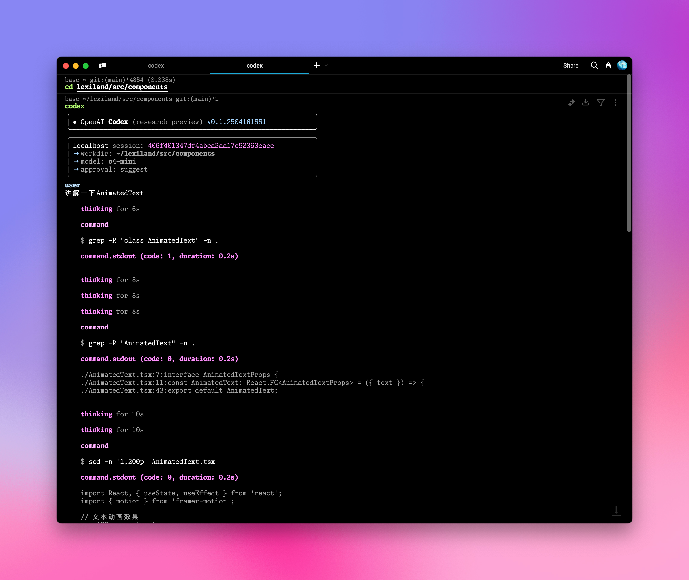
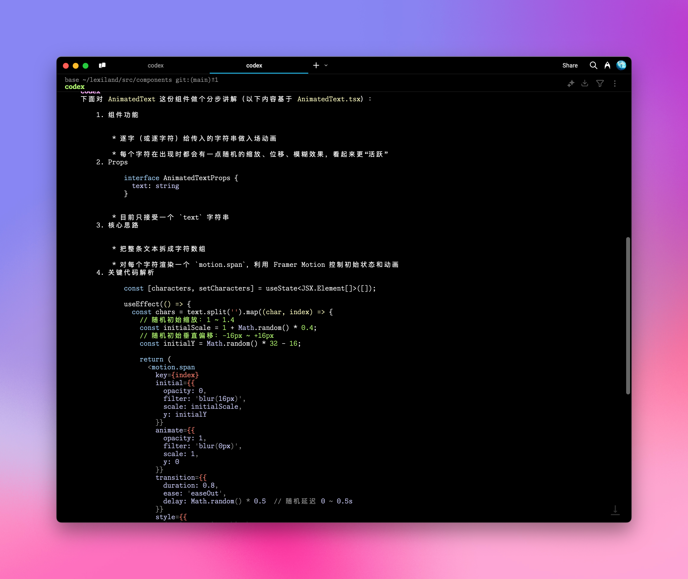

# OpenAI Codex CLI 集成

AiHubMix 提供了與 OpenAI [Codex CLI](https://github.com/openai/codex) 的無縫集成，讓你可以在命令列環境中利用先進的 AI 程式助手。透過簡單的配置步驟，即可在終端機中直接使用自然語言執行各種程式和系統操作任務。

使用之前，請先執行以下指令安裝或更新：  
```bash
npm install -g @openai/codex
```

## 配置步驟

### 1. 環境變數設定

打開你的 Shell 配置檔（例如 `.zshrc` 或 `.bashrc`），新增以下環境變數：

```bash
export OPENAI_BASE_URL="https://api.aihubmix.com/v1"
export OPENAI_API_KEY="sk-***" # 替換為你的 AiHubMix API 密鑰
```

<Warning>
這裡的 `OPENAI_API_KEY` 應該使用 AiHubMix 的[密鑰](https://aihubmix.com/token)，變數名稱保持為 `OPENAI_API_KEY` 是為了相容 OpenAI 原生客戶端。
</Warning>

### 2. 套用配置變更

在終端機中執行以下指令，使環境變數生效：

```bash
source ~/.zshrc  # 如果使用 zsh
# 或
source ~/.bashrc  # 如果使用 bash
```

### 3. 啟動 Codex CLI

定位到你的專案目錄，然後執行 `codex` 指令：

```bash
cd /你的專案路徑
codex
```
  

### 4. 使用自然語言執行任務

現在你可以透過自然語言向 Codex CLI 輸入指令，例如：

```bash
# 範例輸入
講解一下 AnimatedText
```
  

## 進階配置

<Tip>
- 預設模型為 `codex-mini-latest`，一個專為編碼任務微調過的 `o4-mini`，可以在 `~/.codex/config.json`修改
- 目前僅支援 OpenAI 家的模型，模型列表可在 [Responses API 文件](https://platform.openai.com/docs/api-reference/responses) 中查看
- 你可以透過編輯 `~/.codex/instructions.md` 檔案來自訂系統提示詞，定制 AI 助手的行為
</Tip>

## 實用指令參考

### 幫助指令
```bash
codex -h
```

### 完整指令選項
```bash
Usage
  $ codex [options] <prompt>

Options
  -h, --help                 顯示幫助資訊並退出
  -m, --model <model>        指定使用的模型 (預設: codex-mini-latest)
  -i, --image <path>         包含圖像輸入的檔案路徑
  -v, --view <rollout>       查看之前保存的會話記錄
  -q, --quiet                非互動模式，僅列印助手的最終輸出
  -a, --approval-mode <mode> 覆蓋審批策略: 'suggest', 'auto-edit', 或 'full-auto'

  --auto-edit                自動批准檔案編輯；仍會提示確認指令
  --full-auto                自動批准沙箱環境中的編輯和指令

  --no-project-doc           不自動包含倉庫中的 'codex.md' 檔案
  --project-doc <file>       包含指定的 Markdown 檔案作為上下文
  --full-stdout              不截斷指令輸出的 stdout/stderr

危險選項
  --dangerously-auto-approve-everything
                             跳過所有確認提示並直接執行指令（無沙箱保護）
                             僅用於臨時本地測試環境

實驗性選項
  -f, --full-context         以"完整上下文"模式啟動，將整個倉庫加載到上下文中
                             並在一次操作中應用批量編輯
                             僅相容 --model 參數

範例
  $ codex "編寫並運行一個列印 ASCII 藝術的 Python 程式"
  $ codex -q "修復構建問題"
```
