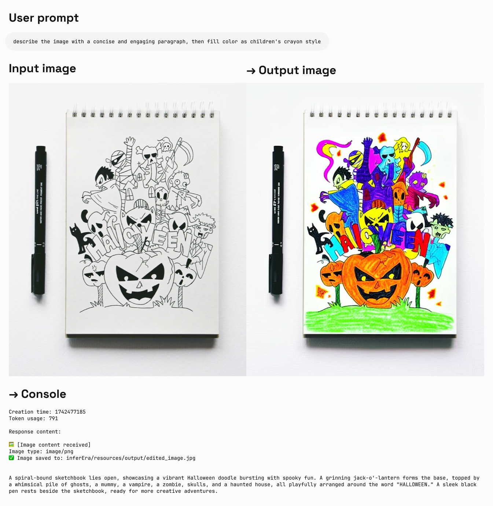
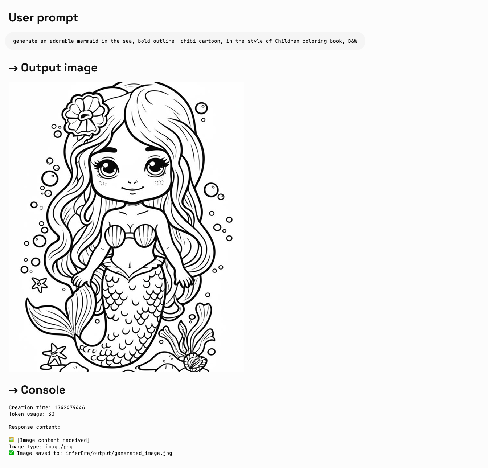

## Imagen 繪圖

Imagen 是 Google 推出的先進圖像生成 AI 模型系列，能夠根據文字提示創建高品質、逼真的圖像。本指南將幫助您了解如何使用 Imagen 系列 API 生成圖像，包括參數設置、模型選擇和程式碼範例。

可用模型列表：

- `imagen-4.0-generate-preview-05-20`：最新的正式預覽版
- `imagen-4.0-ultra-generate-exp-05-20`：更高級的 4.0 實驗款
- `imagen-3.0-generate-002`：3.0 正式版

<Tip>
  1. 目前 Imagen 僅支援英文提示詞（prompt），整合時建議增加自動翻譯，讓使用者能夠無障礙使用
  2. 繪製大量文字的表現不穩定，建議只繪製重點關鍵詞
  3. 搶先體驗期間，Imagen 系列模型同價，後續可能會按官方正式價格調整。
</Tip>

### 模型參數

Imagen 目前僅支援英文提示詞，並提供以下參數：

- **numberOfImages**: 要生成的圖像數量，範圍從 1 到 4（含）。默認值為 4。另外注意 `imagen-4.0-ultra-generate-exp-05-20` 單次只能生成 1 張。
- **aspectRatio**: 更改生成圖像的寬高比。支援的值有 "1:1"、"3:4"、"4:3"、"9:16" 和 "16:9"。默認值為 "1:1"。
- **personGeneration**: 允許模型生成人物圖像。支援以下值：
  - "DONT_ALLOW": 阻止生成人物圖像。
  - "ALLOW_ADULT": 生成成人圖像，但不生成兒童圖像。這是默認值。

### 費率

使用 Imagen API 生成圖像的費用為 **\$0.03/張**。請注意，每次調用可以生成 1-4 張圖像，費用將按實際生成的圖像數量計算。

### 調用示例

以下是使用 Imagen 生成圖像的 Python 調用示例：

<CodeGroup>

```py Imagen
import os
import time
from google import genai
from google.genai import types
from PIL import Image
from io import BytesIO

client = genai.Client(
    api_key="sk-***", # 🔑 換成你在 AiHubMix 生成的密鑰
    http_options={"base_url": "https://aihubmix.com/gemini"},
)

# 目前只支援英文 prompt，繪製大量文字的表現較差
response = client.models.generate_images(
    model='imagen-3.0-generate-002',
    prompt='A minimalist logo for a LLM router market company on a solid white background. trident in a circle as the main symbol, with ONLY text \'InferEra\' below.',
    config=types.GenerateImagesConfig(
        number_of_images=1,
        aspect_ratio="1:1", # supports "1:1", "9:16", "16:9", "3:4", or "4:3".
    )
)

script_dir = os.path.dirname(os.path.abspath(__file__))
output_dir = os.path.join(script_dir, "output")

os.makedirs(output_dir, exist_ok=True)

# 生成時間戳作為文件名前綴，避免文件名衝突
timestamp = int(time.time())

# 保存並顯示生成的圖片
for i, generated_image in enumerate(response.generated_images):
  image = Image.open(BytesIO(generated_image.image.image_bytes))
  image.show()
  
  file_name = f"imagen3_{timestamp}_{i+1}.png"
  file_path = os.path.join(output_dir, file_name)
  image.save(file_path)
  
  print(f"圖片已保存至：{file_path}")
```

</CodeGroup>

### 提示詞技巧

創建有效的提示詞對於獲得理想的圖像至關重要：

- 使用詳細的描述，包括主題、風格、光照、角度等。
- 指定藝術風格（如電影感、寫實主義、動漫風格等）。
- 包含技術細節（如 DSLR、高清、細節豐富等）。
- 避免負面或違禁內容。
- **避免在提示詞中包含大量文字**，僅使用重點關鍵詞以獲得更穩定的結果。
- 關鍵詞包含 `girl` 時容易觸發 TypeError: 'NoneType' object is not iterable 報錯，不推薦用於人物繪製

## Gemini 2.0 Flash 圖像生成

Gemini 也提供了圖像生成能力，作為一種替代方案。與 Imagen 3.0 相比，Gemini 的圖像生成更適合於需要上下文理解和推理的場景，而非追求極致的藝術表現和視覺質量。

- 更高的視覺質量 → 相比 exp 版，圖像更銳利、更豐富、更清晰。
- 更準確的文字呈現 → 生成的視覺中，文字更加精准、乾淨、易讀。
- 顯著減少過濾攔截 → 得益於更智能、寬鬆的過濾機制，創作時幾乎不再被打斷。

**說明：**

- 模型 id：`gemini-2.0-flash-preview-image-generation`
- 費率（輸入→輸出）：$0.1→$0.4/M tokens
- 需要新增參數來體驗新特性 `"modalities":["text","image"]`
- 圖片以 Base64 編碼形式傳遞與輸出
- 作為實驗模型，建議明確指出 "輸出圖片"，否則可能只有文字
- 輸出圖片的默認高度為 1024px
- python 調用需要最新的 openai sdk 支援，請先運行 `pip install -U openai`
- 了解更多請訪問 [Gemini 官方文件](https://ai.google.dev/gemini-api/docs/image-generation)

<Tip>
  `gemini-2.0-flash-exp` 已經正式升級為 `gemini-2.0-flash-preview-image-generation`，讓你的創作流程更流暢、更精彩。
</Tip>

**輸入參考結構：**

```json
"modalities": ["text","image"]
{
    "model": "gemini-2.0-flash-preview-image-generation",
    "messages": [
      {
        "role": "user",
        "content": "生成一幅山水畫，並給出一首詩詞描述"
      }
    ],
    "modalities":["text","image"], //需要添加 image
    "temperature": 0.7
  }'
```

**輸出參考結構：**

```json
"choices":
    [
        {
            "index": 0,
            "message":
            {
                "role": "assistant",
                "content": "Hello! How can I assist you today?",
                "refusal": null,
                "multi_mod_content": //📍 新增
                [
                    {
                        "text": "",
                        "inlineData":
                        {
                          "data":"base64 str",
                          "mimeType":"png"
                        }
                    },
                    {
                        "text": "hello",
                        "inlineData":
                        {
                        }
                    }
                ],
                "annotations":
                []
            },
            "logprobs": null,
            "finish_reason": "stop"
        }
    ],
```

### 圖文生成

Iuput：text
Output：text \+ image

<CodeGroup>

```shell Curl
IMG_PATH="/your_path/image.jpg"

if [[ "$(base64 --version 2>&1)" = *"FreeBSD"* ]]; then
  B64FLAGS="--input"
else
  B64FLAGS="-w0"
fi

IMG_BASE64=$(base64 "$B64FLAGS" "$IMG_PATH" 2>&1)

curl https://aihubmix.com/v1/chat/completions \
  -H "Content-Type: application/json" \
  -H "Authorization: Bearer sk-***" \
  -d '{
    "model": "gemini-2.0-flash-preview-image-generation",
    "messages": [
      {
        "role": "user",
        "content": [
          {
            "type":"text",
            "text":"describe the image with a concise and engaging paragraph, then fill color as children's crayon style"
          },
          {
            "type": "image_url",
            "image_url": {
              "url": "data:image/jpeg;base64,'$IMG_BASE64'"
            }
          }
        ]
      }
    ],
    "modalities": ["text","image"],
    "temperature": 0.7
}' \
  | grep -o '"data":"[^"]*"' \
  | cut -d'"' -f4 \
  | base64 --decode > /your_path/imageGen.jpg
```


```py Python
import os
from openai import OpenAI
from PIL import Image
from io import BytesIO
import base64

client = OpenAI(
    api_key="sk-***", # 換成你在 AiHubMix 生成的密鑰
    base_url="https://aihubmix.com/v1",
)

# Using text-only input
response = client.chat.completions.create(
    model="gemini-2.0-flash-preview-image-generation",
    messages=[
        {
            "role": "user",
            "content": [
                {
                    "type": "text",
                    "text": "generate an adorable mermaid in the sea, bold outline, chibi cartoon, in the style of Children coloring book, B&W, HD",
                }
            ],
        },
    ],
    modalities=["text", "image"],
    temperature=0.7,
)
try:
    # Print basic response information
    print(f"Creation time: {response.created}")
    print(f"Token usage: {response.usage.total_tokens}")
    
    # Check if multi_mod_content field exists
    if (
        hasattr(response.choices[0].message, "multi_mod_content")
        and response.choices[0].message.multi_mod_content is not None
    ):
        print("\nResponse content:")
        for part in response.choices[0].message.multi_mod_content:
            if "text" in part and part["text"] is not None:
                print(part["text"])
            
            # Process image content
            elif "inline_data" in part and part["inline_data"] is not None:
                print("\n🖼️ [Image content received]")
                image_data = base64.b64decode(part["inline_data"]["data"])
                mime_type = part["inline_data"].get("mime_type", "image/png")
                print(f"Image type: {mime_type}")
                
                image = Image.open(BytesIO(image_data))
                image.show()
                
                # Save image
                output_dir = os.path.join(os.path.dirname(os.path.abspath(__file__)), "output")
                os.makedirs(output_dir, exist_ok=True)
                output_path = os.path.join(output_dir, "generated_image.jpg")
                image.save(output_path)
                print(f"✅ Image saved to: {output_path}")
            
    else:
        print("No valid multimodal response received, check response structure")
except Exception as e:
    print(f"Error processing response: {str(e)}")
```

</CodeGroup>

**輸出實例：**



### 圖片編輯

Iuput：text \+ image\
Output：text \+ image

<CodeGroup>

```py Python
import os
from openai import OpenAI
from PIL import Image
from io import BytesIO
import base64

client = OpenAI(
    api_key="sk-***", # 換成你在 AiHubMix 生成的密鑰
    base_url="https://aihubmix.com/v1",
)

project_root = os.path.dirname(os.path.dirname(os.path.abspath(__file__)))

image_path = os.path.join(os.path.dirname(os.path.abspath(__file__)), "resources", "filled.jpg")
if not os.path.exists(image_path):
    raise FileNotFoundError(f"image {image_path} not exists")

def encode_image(image_path):
    with open(image_path, "rb") as image_file:
        return base64.b64encode(image_file.read()).decode("utf-8")

base64_image = encode_image(image_path)

response = client.chat.completions.create(
    model="gemini-2.0-flash-preview-image-generation",
    messages=[
        {
            "role": "user",
            "content": [
                {
                    "type": "text",
                    "text": "describe the image with a concise and engaging paragraph, then fill color as children's crayon style",
                },
                {
                    "type": "image_url", 
                    "image_url": {"url": f"data:image/jpeg;base64,{base64_image}"},
                },     
            ],
        },
    ],
    modalities=["text", "image"],
    temperature=0.7,
)
try:
    # Print basic response information without base64 data
    print(f"Creation time: {response.created}")
    print(f"Token usage: {response.usage.total_tokens}")
    
    # Check if multi_mod_content field exists
    if (
        hasattr(response.choices[0].message, "multi_mod_content")
        and response.choices[0].message.multi_mod_content is not None
    ):
        print("\nResponse content:")
        for part in response.choices[0].message.multi_mod_content:
            if "text" in part and part["text"] is not None:
                print(part["text"])
            
            # Process image content
            elif "inline_data" in part and part["inline_data"] is not None:
                print("\n🖼️ [Image content received]")
                image_data = base64.b64decode(part["inline_data"]["data"])
                mime_type = part["inline_data"].get("mime_type", "image/png")
                print(f"Image type: {mime_type}")
                
                image = Image.open(BytesIO(image_data))
                image.show()
                
                # Save image
                output_dir = os.path.join(os.path.dirname(image_path), "output")
                os.makedirs(output_dir, exist_ok=True)
                output_path = os.path.join(output_dir, "edited_image.jpg")
                image.save(output_path)
                print(f"✅ Image saved to: {output_path}")
            
    else:
        print("No valid multimodal response received, check response structure")
except Exception as e:
    print(f"Error processing response: {str(e)}")
```

</CodeGroup>

**輸出實例：**



## 選擇正確的繪圖模型

### 選擇 Gemini 的情況：

- 需要利用世界知識和推理能力生成上下文相關的圖像。
- 需要無縫混合文字和圖像。
- 希望在長文字序列中嵌入準確的視覺內容。
- 希望在保持上下文的同時以對話方式編輯圖像。

### 選擇 Imagen 的情況：

- 圖像質量、照片真實感、藝術細節或特定風格（如印象派、動漫）是首要考慮因素。
- 執行專業編輯任務，如產品背景更新或圖像放大。
- 注入品牌、風格或生成標誌和產品設計。

### 最佳實踐

1. **優化提示詞**：精心設計提示詞，這是獲得高品質輸出的關鍵。
2. **實驗參數**：嘗試不同的寬高比和設置，找到最適合您需求的配置。
3. **批量生成**：生成多張圖像以增加獲得理想結果的機會。
4. **保存元數據**：將提示詞和時間戳與圖像一起保存，以便追踪和複製成功的結果。
5. **遵守使用政策**：確保您的使用符合 Google 的內容政策和使用條款。

## Veo 3.0 影片生成

VEO 3.0 是由 Google DeepMind 開發的最新先進影片生成模型。使用 [VEO 3.0](https://aihubmix.com/models?model=veo-3.0-generate-preview)，您可以生成具有以下特點的影片：

- 從文字和圖像提示中生成的質量提升
- 語音，例如對話和配音
- 音頻，例如音樂和聲音效果

<Tip>
  1. 目前 VEO 3.0 僅支援英文提示詞（prompt），整合時建議增加自動翻譯
  2. 影片通常在幾分鐘內生成完成，但高峰期可能需要更長時間
  3. 目前不支援用圖片進行對話生成的影片
</Tip>

### 已知限制

目前 VEO 3.0 的參數固定，無法更改：

- **分辨率**: 720p（橫屏）
- **幀率**: 24fps
- **影片長度**: 8秒

### 費率

使用 VEO 3.0 API 的費用是 **\$0.675/秒**（Aihubmix 提供 10% 限時優惠）

### 調用示例

VEO 3.0 目前僅支援 curl 命令調用，採用兩步處理方式：
其中：`sk-***` 換成你在 AiHubMix 生成的密鑰。

<CodeGroup>

```shell 步驟 1：發起生成請求
curl "https://aihubmix.com/gemini/v1beta/models/veo-3.0-generate-preview:predictLongRunning?key=sk-***" \
  -H "Content-Type: application/json" \
  -X "POST" \
  -d '{
    "instances":
    [
        {
            "prompt": "A cat playing with a ball"
        }
    ],
    "parameters":
    {
        "numberOfVideos": 1,
        "durationSeconds": 8,
        "aspectRatio": "16:9",
        "personGeneration": "dont_allow"
    }
}'
```


```shell 步驟 2：獲取生成結果
# 使用步驟 1 返回的 name 字段中的操作ID
curl "https://aihubmix.com/gemini/v1beta/models/veo-3.0-generate-preview/operations/ff5***?key=sk-***"
```


```py 影片提取腳本
import json
import base64

# 1. 讀入響應 JSON 文件
with open('yourpath/response.json', 'r') as f:
    data = json.load(f)

# 2. 獲取 base64 編碼的影片字符串
b64_str = data['response']['videos'][0]['bytesBase64Encoded']

# 3. 解碼並寫入 mp4 文件
with open('output.mp4', 'wb') as f:
    f.write(base64.b64decode(b64_str))

print("影片已保存為 output.mp4")
```

</CodeGroup>

### 返回示例

**步驟 1 返回：**

```json
{
  "name": "models/veo-3.0-generate-preview/operations/ff5***"
}
```

**步驟 2 返回（生成完成）：**

```json
{
  "name": "projects/ahm-gemini-03/locations/us-central1/publishers/google/models/veo-3.0-generate-preview/operations/ff5***",
  "done": true,
  "response": {
    "@type": "type.googleapis.com/cloud.ai.large_models.vision.GenerateVideoResponse",
    "raiMediaFilteredCount": 0,
    "videos": [
      {
        "bytesBase64Encoded": "AAA...2xl",
        "mimeType": "video/mp4"
      }
    ]
  }
}
```

**步驟 2 返回（仍在處理中）：**

```json
{
  "name": "projects/ahm-gemini-03/locations/us-central1/publishers/google/models/veo-3.0-generate-preview/operations/777***"
}
```

如果收到處理中的返回，請稍等幾分鐘後重新發送步驟 2 的請求。

**影片效果：**

<video controls className="w-full aspect-video rounded-2xl" src="../../public/en/veo-3-output.mp4" />

### 最佳實踐

1. **耐心等待**：影片生成通常需要幾分鐘，高峰期可能更長
2. **檢查狀態**：如果返回中沒有 `done: true`，說明仍在處理中
3. **保存操作 ID**：確保保存步驟 1 返回的操作 ID 用於後續查詢
4. **遵守使用政策**：確保您的使用符合 Google 的內容政策和使用條款

更多信息請參考 [Vertex AI 官方文件](https://cloud.google.com/vertex-ai/generative-ai/docs/video/generate-videos)

## Veo 3.0 逆向接口調用方式

AIhubmix 提供和官方效果一致但費率更低的逆向調用方式——單次生成總費用為 $0.41。但請注意，任何逆向的調用方式都不能保障穩定的生成，推薦在開發環境作為早期實驗或僅用於個人體驗。

已知限制和官方正式接口一致，見上方「Veo 3.0 影片生成」章節。

### 調用示例

VEO 3.0 逆向接口使用 Openai 兼容方式，只需要傳入模型 id `veo-3`和影片提示詞即可。

<CodeGroup>

```py Pthon
from openai import OpenAI

client = OpenAI(
    api_key="sk-***", # 🔑 換成你在 AiHubMix 生成的密鑰
    base_url="https://aihubmix.com/v1",
)

completion = client.chat.completions.create(
    model="veo-3",
    messages=[
        {
            "role": "user",
            "content": "a mechanical butterfly flying in the futuristic garden"
        }
    ],
    stream=False
)

print(completion.choices[0].message.content)
```

</CodeGroup>

### 返回示例

生成結果是連接，請及時保存到本地。

```json
{
  "prompt": "A sleek, metallic mechanical butterfly with intricate, glowing blue circuitry patterns on its wings flies gracefully through a futuristic garden. The garden is filled with bioluminescent plants, floating orbs of light, and holographic flowers that change colors. The butterfly's wings reflect the ambient light, creating a mesmerizing shimmer as it moves. The background features a sleek, minimalist cityscape with towering glass structures and hovering drones. The scene is bathed in a soft, ethereal glow from a setting sun, casting long shadows and enhancing the futuristic ambiance. The camera follows the butterfly in a smooth, cinematic motion, capturing the delicate movements of its wings and the vibrant, otherworldly beauty of the garden."
}
```

```json
> Video generation task created
> Task ID: `8167db37-2b7c-4794-9232-891d02ca7fa3`
> To prevent task interruption, you can continuously track progress from the following links:
> [Data Preview](https://asyncdata.net/web/8167db37-2b7c-4794-9232-891d02ca7fa3) | [Source Data](https://asyncdata.net/source/8167db37-2b7c-4794-9232-891d02ca7fa3)
> Waiting for processing

> Type: Text-to-video generation
> 🎬 Starting video generation...................

> ⚠️ Retrying (0/3)

> Type: Text-to-video generation
> 🎬 Starting video generation.....................

> 🔄 Optimizing video quality.................

> 🎉 High-quality video generated

[▶️ Watch Online](https://filesystem.site/cdn/20250615/T7yfqW229fox4gJA1ys0eMAGLkcSfd.mp4) | [⏬ Download Video](https://filesystem.site/cdn/download/20250615/T7yfqW229fox4gJA1ys0eMAGLkcSfd.mp4)
```

## Veo 2.0 影片生成

VEO 2.0 是 Google 推出的先進影片生成 AI 模型，能夠根據文字提示創建高品質、逼真的短影片。下面的指南將幫助您了解如何使用 VEO 2.0 API 生成影片，包括參數設置、模型選擇和程式碼範例。

<Tip>
  1. 目前 VEO 2.0 僅支援英文提示詞（prompt），整合時建議增加自動翻譯，讓使用者能夠無障礙使用
  2. 生成影片需要耗時 2-3 分鐘，請耐心等待
</Tip>

### 模型參數

VEO 2.0 提供以下參數：

- **numberOfVideos**: 要生成的影片數量，可選 1 或 2。默認值為 2。
- **aspectRatio**: 生成影片的寬高比。支援的值有 "16:9" 和 "9:16"。
- **durationSeconds**: 影片時長，可選 5 秒或 8 秒。默認值為 8 秒。
- **personGeneration**: 控制是否允許生成含人物的影片。支援以下值：
  - "dont_allow": 阻止生成含人物的影片。
  - "allow_adult": 允許生成含成人的影片，但不生成兒童影片。

### 費率

使用 VEO 2.0 API 的費用是 \$0.35/秒

### 調用示例

以下是使用 VEO 2.0 生成影片的 Python 調用示例：

<CodeGroup>

```py 文生影片
import os
import time
from google import genai
from google.genai import types

client = genai.Client(
    api_key="sk-***", # 換成你在 AiHubMix 生成的密鑰
    http_options={"base_url": "https://aihubmix.com/gemini"},
)

operation = client.models.generate_videos(
    model="veo-2.0-generate-001",
    prompt="Panning wide shot of a calico kitten sleeping in the sunshine",
    config=types.GenerateVideosConfig(
        person_generation="dont_allow",  # "dont_allow" 或 "allow_adult"
        aspect_ratio="16:9",  # "16:9" 或 "9:16"
        number_of_videos=1, # 整數，可選 1、2，默認 2
        durationSeconds=5, # 整數，可選 5、8，默認 8
    ),
)

# 耗時 2-3 分鐘，影片時長 5-8s
while not operation.done:
    time.sleep(20)
    operation = client.operations.get(operation)

for n, generated_video in enumerate(operation.response.generated_videos):
    client.files.download(file=generated_video.video)
    generated_video.video.save(f"video{n}.mp4")  # 保存影片
```


```py 參考圖驅動
import os
import time
from google import genai
from google.genai import types

def load_image(path):
    with open(path, "rb") as image_file:
        return image_file.read()
    
client = genai.Client(
    api_key="sk-***", # 換成你在 AiHubMix 生成的密鑰
    http_options={"base_url": "https://aihubmix.com/gemini"},
)

operation = client.models.generate_videos(
    model="veo-2.0-generate-001",
    prompt="The waves in the background keep flowing",
    image=types.Image(
        mime_type="image/png", 
        image_bytes=load_image("img/inferbanner.png")  # 使用你的圖片路徑
    ),
    config=types.GenerateVideosConfig(
        person_generation="dont_allow",
        aspect_ratio="16:9",
        numberOfVideos=1,
        durationSeconds=5,
    ),
)

while not operation.done:
    time.sleep(20)
    operation = client.operations.get(operation)

for n, generated_video in enumerate(operation.response.generated_videos):
    client.files.download(file=generated_video.video)
    generated_video.video.save(f"video{n}.mp4")
```

</CodeGroup>

### 提示詞技巧

創建有效的提示詞對於獲得理想的影片至關重要：

- 描述清晰的場景、動作和氛圍
- 指定拍攝風格（如全景、特寫、跟隨鏡頭等）
- 描述光照條件（如陽光明媚、黃昏、室內燈光等）
- 指明主體對象及其動作（如"貓咪在陽光下睡覺"）
- 避免過於複雜的叙事或快速變化的場景
- 避免負面或違禁內容

### 最佳實踐

1. **簡潔明瞭的提示詞**：使用清晰、具體的描述來指導影片生成。
2. **耐心等待**：影片生成需要 2-3 分鐘，請耐心等待完成。
3. **測試不同參數**：嘗試不同的寬高比和時長，找到最適合您需求的設置。
4. **保存生成記錄**：將提示詞與生成的影片一起記錄，以便追踪成功的結果。
5. **遵守使用政策**：確保您的使用符合 Google 的內容政策和使用條款。