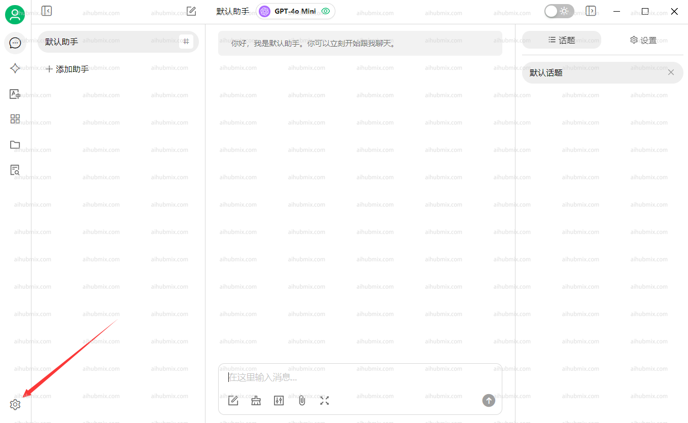
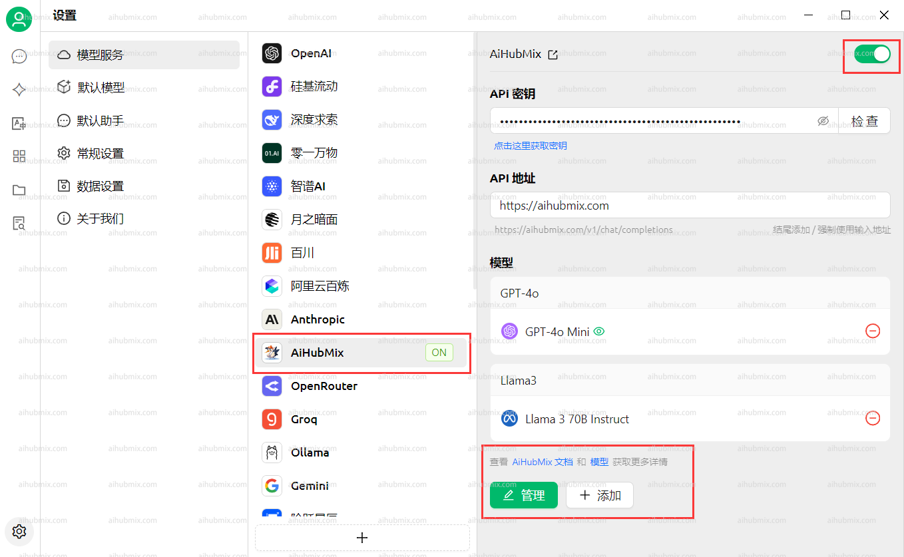
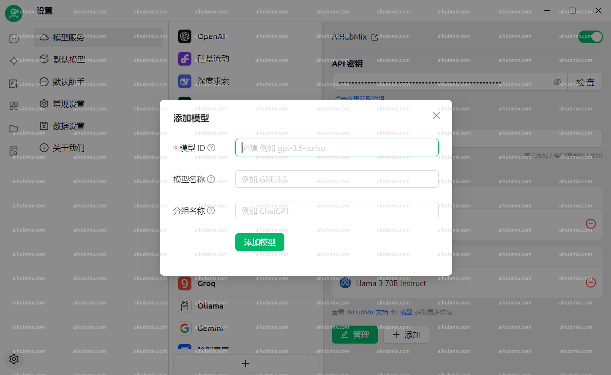
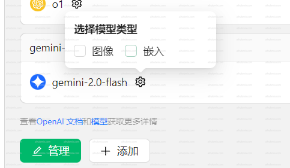

**[Cherry Studio AI 下載地址](https://easys.run/cherry-studio/)**

## 通常使用方法
1. 應用左下角開啟設定。  
  
2. 在模型供應商介面選擇我們的 AiHubMix，點擊右上角按鈕啟用。  
3. API 密鑰一欄輸入[本站的 Key](https://aihubmix.com/token)，API 地址一欄不用修改。  
**注：如果檢查不通過嘗試關閉 vpn**  
 
4. 下方點擊新增模型，模型 ID 從本網站的設定介面選擇想要使用的模型複製貼上名稱。  
 

## 如果遇到模型看不到圖片的問題
一些新模型可能遇到輸入圖片後模型看不到的問題。需要在設定頁面手動勾選圖像選項。  
