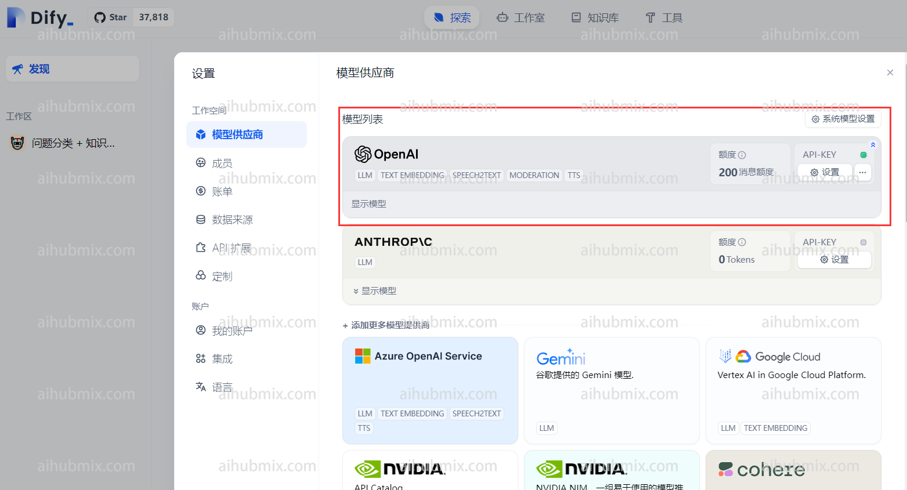
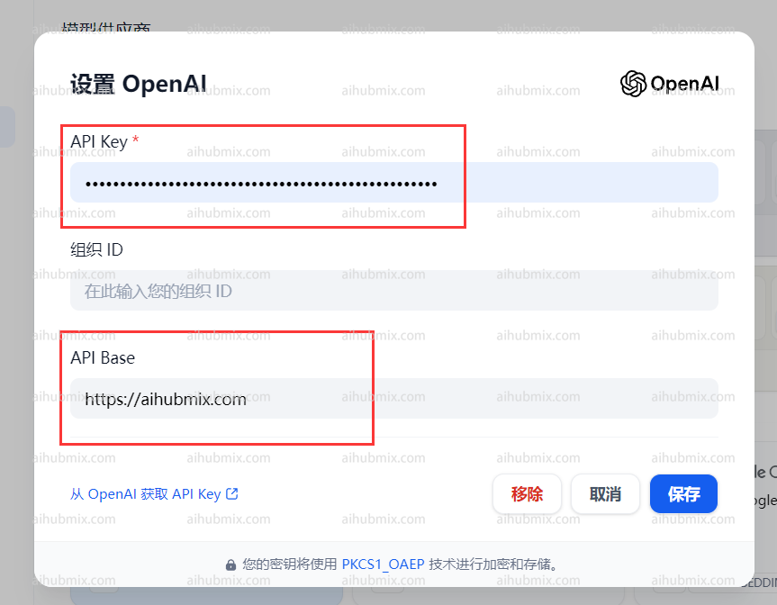
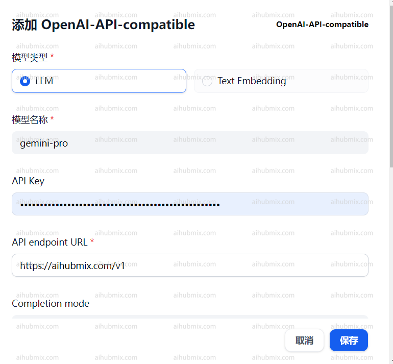

## 通常使用情況（使用OpenAI模型）
網頁右上角點擊自己的使用者名稱，進入設定介面。  
在模型供應商中選擇ApenAI並開啟設定。  
 
- 在API Key一欄輸入[本站的Key](https://aihubmix.com/token)。  
- 在API Base一欄輸入：
```
https://aihubmix.com
```  
 

## 使用非OpenAI模型方法  
在模型供應商下拉找到OpenAI-API-compatible並點擊新增模型。  

- 開啟網站後台設定頁面，找到模型清單。
- 複製你想要使用的模型名稱（如gemini-pro或claude-3-opus-20240229）。
- 在API Key一欄輸入[本站的Key](https://aihubmix.com/token)。  
- 在API endpoint URL一欄輸入：
```
https://aihubmix.com/v1
```  
