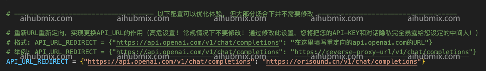

1. 開啟 gpt_academic/config.py 檔案：  
 
1. 找到 config.py 中的 API_KEY 變數，將[本站的Key](https://aihubmix.com/token)填入，即可：  
 
2. 往下滾動，找到 config.py 中的 API_URL_REDIRECT 變數，修改為（直接複製下面的程式碼區塊進去就行）：  
```
API_URL_REDIRECT = {"https://api.openai.com/v1/chat/completions": "https://aihubmix.com/v1/chat/completions"}
```
 
3. 然後就能用了  
 
