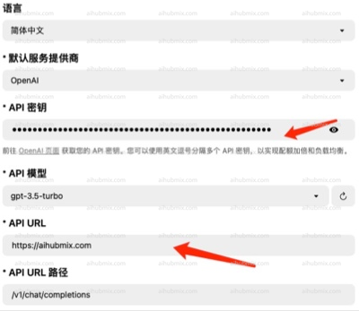
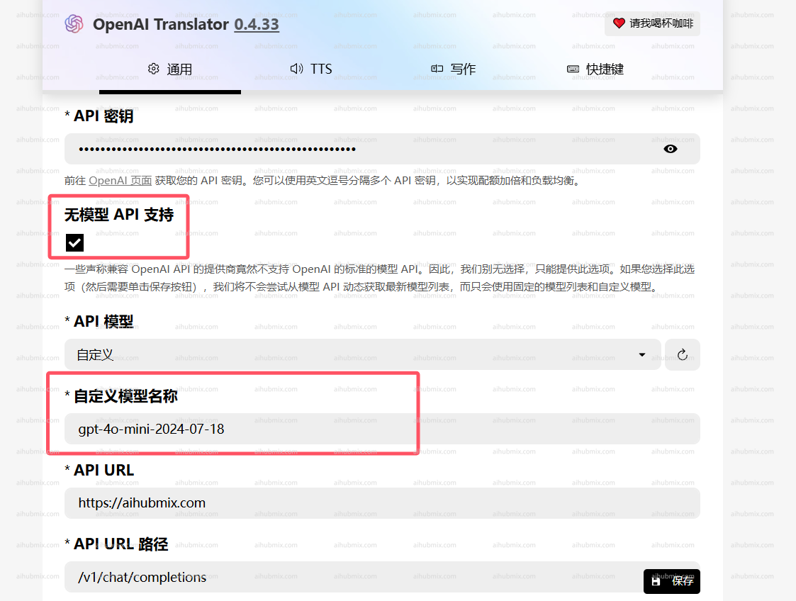

- 例如：OpenAI Translator；  
- API 密鑰 改成，從[本站的 Key](https://aihubmix.com/token) 中產生。  
- API URL 改為：
```
https://aihubmix.com
```
(注意 url 結尾不要帶「/」)  
 

## 如果遇到模型刷不出來的問題看這裡
**注：**
如果是 0.4.33 和 0.4.34 版本無法載入模型請退回舊版本，
舊版本地址：https://github.com/openai-translator/openai-translator/releases/tag/v0.4.32  
如果遇到 OpenAl Translator 無法選擇 api 模型的問題。
  
**可以嘗試下列方法解決：**
- 勾選「無模型 api 支援」選項。
- 從我們網站的設定頁面複製模型名，手動填入。

